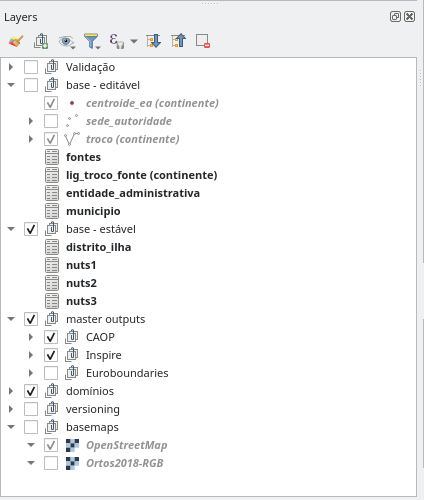
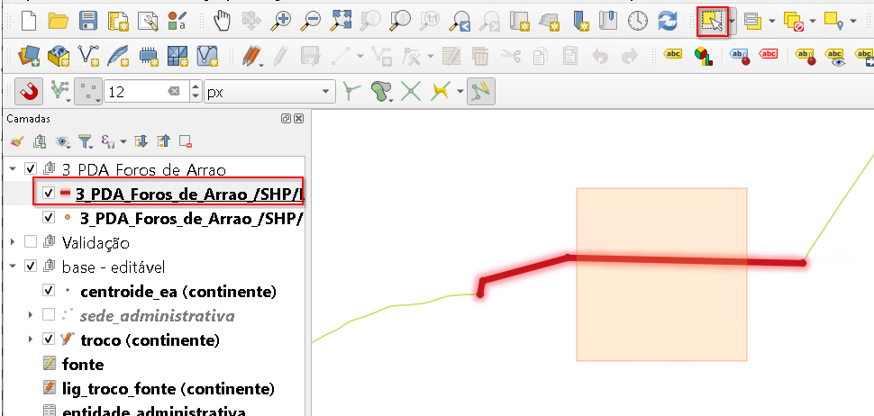

# Visualização e edição dos dados CAOP em QGIS

Para tornar a visualização e edição dos dados da CAOP de forma adequada e conveniente,
foram criados projectos QGIS para cada umas das regiões com Sistemas de Coordenadas de Referência diferentes:

* `projecto_caop_edicao_cont`
* `projecto_caop_edicao_ram`
* `projecto_caop_edicao_raa_oci`
* `projecto_caop_edicao_raa_cen_ori`

Os projectos estão guardados directamente na base de dados. Por uma questão de salvaguarda dos projectos, estes são *read-only* para os editores. Para efectuar alterações permanentes aos projectos é necessário usar-se o utilizador `administrador`.

## Configuração da ligação à base de dados

Tanto os dados, como os projectos de edição preparados são guardados numa base de dados PostgreSQL/PostGIS. Por essa razão, para aceder aos mesmos através do QGIS, a primeira operação será estabelecer uma ligação à base de dados.

:::columns

 1. Abrir o QGIS
 
 2. Se não estiver visível, activar o painel **Navegador** no menu **Configurações** > **Paineis** > **Navegador**
 
 3. No painel **Navegador**, clicar com o botão direito do rato sobre o item **PostgreSQL** e escolher a opção **Nova ligação**
 
 4. Na janela **Criar nova ligação PostGIS**, preencher os seguintes campos:
 
    * **Nome:** `CAOP Produção` ou `CAOP Testes`
    * **Máquina:** `192.168.10.102`
    * **Porta:** `5432`
    * **Base de dados:** `caop` ou `caop_testes`
 
 5. Ainda na janela **Criar nova ligação PostGIS**, na secção **Autenticação**, escolher o separador **Configurações** e clicar no botão **Criar nova configuração de autenticação**.
 
 6. Se exigido, escolha uma palavra-passe mestra. Esta será a única palavra-passe que terá de decorar quando precisar de aceder a projectos com necessidade de autenticação.

    
 
 7. Na janela **Autenticação**, junto ao **Id** clicar no símbolo do cadeado e
    preencher o campo com `dgtprod`
 
 8. Ainda na janela **Autenticação**, preencher os seguintes campos e clicar em **Save**:

    * **Nome:** `Nome à escolha` (e.g. Credenciais CAOP)
    * `Basic authentication`
    * **Utilizador:** `Nome do utilizador PostgreSQL` (e.g. `user1`)
    * **Palavra-passe:** `Password do utilizador` (e.g. `pass1`)
 
    

 9. De volta à janela **Criar nova ligação PostGIS**, clicar em **Testar ligação** para garantir que todos os dados de acesso estão correctos.

10. Garantir que pelo menos a opção **Permitir guardar e carregar projetos QGIS na base de dados** e clicar em **OK**

    

Se tudo tiver sido executado correctamente, no painel **Navegador** deverá ser possível visualizar a recém-criada ligação, clicando na mesma será possível visualizar o seu conteúdo.

:::

## Instalação plugin CAOP Tools

Para auxiliar no processo de edição da CAOP e na geração dos conjuntos de dados finais, foi criado um plugin para QGIS com as seguintes funcionalidades:

* Pré-preenchimento do campo `motivo` nos campos editados
* Actualização dos conjuntos de dados finais no schema master, como base no estado actual da base de dados (trocos, centroides, etc...)
* Criar nova versão da CAOP
* Ferramenta de corte de troços CAOP

A instalação do plugin é feita através do arquivo Zip fornecido.

:::columns

1. Abrir o gestor de plugins em **Plugins** > **Gerir e instalar plugins...**
2. Escolher o separador **Instalar de um ZIP**
3. Clicar no campo **ZIP file** clicar no botão **...** (Navegar) e indique o caminho até ao ficheiro `caop_tools_x.x.x.zip` fornecido.
4. Clicar em **Instalar módulo**.
5. Fechar a janela dos **Plugins**

   

:::

## Edição dos dados CAOP (Geral)

### Abrir projecto de Edição

A edição dos dados CAOP é feita através de quatro projectos de edição preparados para QGIS, um por cada região para que se trabalhe sempre no sistema de coordenadas correcto.

Os projectos de edição estão guardados na base de dados, dentro do schema `public`. Para abrir um projecto seguimos os seguinte passos:

:::columns

1. Aceder ao painel **Navegador**
2. Expandir a ligação à base de dados criada de antemão
3. Expandir o schema `public`.
4. Fazer duplo-clique sobre o nome do projecto (e.g. `projecto_caop_edicao_cont`) ou simplesmente arrastando-o para a área do mapa.

   

:::

Os projectos de edição estão organizados por grupos da seguinte forma:

* **validação** - camadas de apoio à validação topológica dos dados.
* **base - editável** - camadas que habitualmente sofrem alterações no processos de actualização da CAOP
* **base - estável** - Camadas pertencentes ao modelo de dados CAOP, mas cuja edição é mais rara.
* **master outputs** - Camadas geradas pelos scripts de outputs para o estado actual da base de dados CAOP
* **dominios** - tabelas auxiliares com listas de valores
* **versioning** - tabelas de backup associados ao sistema de histórico
* **basemaps** - camadas auxiliares de contexto

### Ligar Snapping

Sempre que se esteja a editar as geometrias da CAOP (em particular os troços) é importante garantir que a função de **snapping** está ligada. O snapping ajuda a garantir a coerência topológica entre os vários troços. Em QGIS, para ligar o snapping, seguimos os seguintes passos:

1. Se não estiver visível, ligar a barra de ferramentas **Snapping** em **Configurações** > **Barras de Ferramentas** > **Barra de Snapping**
2. Na barra de snapping, habilitar o snapping carregando no icon do iman.
3. Em termos de opções, no segundo botão da esquerda sugere-se o uso da **Camada activa** para apenas fazer snapping com elementos da camada `troco`. Caso se pretenda usar outras camadas como referência, sugere-se usar a opção **Configuração Avançada** e no botão **Editar Configuração Avançada** seleccionar apenas as camadas relevantes.
4. No terceiro botão da esquerda, deve-se usar só a opção **Vértices**

   

### Preencher o motivo

Na barra de Ferramentas **CAOP Tools** existe um campo de texto, onde se deve preencher o motivo da actual edição. Este texto é guardado automaticamente nos registos das tabelas, ajudando a descrever o histórico de cada registo. Este texto pode ser, por exemplo, idêntico à descrição da fonte que originou a alteração.

## Execução de operações de edição comuns

### Alterar geometria de uma fronteira (troço)

Uma das edições mais comuns é a alteração de uma fronteira entre duas freguesias. Para isso, é preciso isolar a secção do troço a alterar do restante, alterar a geometria do troço isolado e atribuir uma nova fonte ao troço alterado.

Neste processo, deve-se usar a ferramentas de **Dividir elementos** específica do plugin CAOP Tools. A ferramenta tem três características que a distingue da ferramenta nativa do QGIS:

* Sempre que um troço é cortado, são sempre atribuidos novos identificadores aos troços resultantes.
* O campo **troco_parente** é preenchido com o identificador do troço original, permitindo-nos manter uma relação de histórico com os novos troços.
* As fontes associadas ao troço original são replicadas a todos os novos troços.

#### Resumo

1. Abrir o projecto QGIS
2. Editar a barra do motivo
3. Adicionar uma nova fonte
4. Adicionar ao projecto a camada temporaria com o novo troço
5. Cortar o(s) troço(s) antigo(s) na junção com o novo e eliminar a secção do troço desnecessário
6. Atribuir ao novo troço a nova fonte

#### Descrição passo a passo

:::columns

1. Seguindo as intruções mostradas acima, abrir o projecto QGIS correspondente à região em que se irá trabalhar (e.g. `projecto_caop_edicao_cont`).

2. Na toolbar **CAOP tools**, editar o campo **Motivo** com a descrição das alterações se vão fazer, por exemplo (e.g. `PDA Foros de Arrão`)

   

3. Carregar o ficheiro de referência com o desenho do novo troço. Para isso, pode usar o file explorer do windows e arrastar para dentro do projecto o ficheiro (gpkg, shp, zip etc...).

4. No painel **camadas** arrastar a(s) nova(s) camada(s) de forma a garantir que está acima de todas as outras.

   
    
5. Ainda no painel **Camadas** clicar com o botão direito do rato na camada de referência e escolher a opção **Aproximar à camada** (Zoom to Layers), para aproximarmos o projecto à área de interesse.

   

6. Mantendo a nova camada de dados activa no painel **Camadas**, carregar no **F7** para abrir o painel **Estilo da camada**. Escolher um estilo bem visível e que se demarque das restantes camadas

   
 
7. No Painel **Camadas**, seleccionar a camada `Fonte` e ligar a edição da mesma.

   

8. Na **Barra de Digitalização**, clique no botão **Adicionar registo** para adicionar uma nova fonte.

   

9. Preencha o formulário a informação relativa à nova fonte e clique em Ok.

   

   **Tipo** - Tipo de fonte, geralmente um diploma
   **Descrição** - Colocar o número e ano do diploma
   **Data** - Data de publicação do diploma
   **Observações** - Colocar o título do diploma
   **Diploma_ref** - Colocar o link para a página do Diário da República referente ao diploma

10. Mantendo a camada `fonte` activa, na **Barra de Digitalização**, carregar no botão **Guardar as edições da camada**, para enviar para a base de dados a nova fonte. 

    

    **Nota**: Se o botão de gravação ficar cinzento, é sinal que a gravação foi um sucesso e a informação da nova fonte ficou gravada na base de dados.

11. No Painel **Camadas**, seleccionar agora a camada `Troço` e ligar a edição da mesma.

    
 
12. Com uma ferramenta de seleção (e.g. **Selecionar por área**), selecionar o(s) troço(s) a cortar. É possível adicionar novos troços à selecção carregando no **Shiff** enquando se desenha um novo rectangulo. Este passo de preselecção não é totalmente obrigatório, mas ajuda a evitar cortes indesejados em outros troços na proximidade.

    

    **NOTA: Antes dos próximos passos não esquecer de activar o Snapping!**

13. Na toolbar `CAOP tools`, activar a ferramenta de corte do CAOP Tools

    

14. Com a ferramenta de corte por cima do mapa, desenhar (clicando com o botão esquerdo do rato para adicionar vértices) uma linha que atravesse o(s) troço(s) no local (ou locais) onde se pretende cortar para isolar os segmentos do troço que irão ser alterados. Para terminar a linha clicar com o botão direito do rato. Sempre que possível, devemos cortar as linhas em vertices já existentes.

    

    **Nota 1:** Este passo pode ser feito através de vários cortes isolados.

    **Nota 2:** Ao desenhar, pode usar a tecla **Delete** para eliminar o último vértice introduzido, em caso de engano.

15. Usando novamente as ferramentas de seleção, seleccione APENAS o troço original a ser eliminado.

    

16. Garantindo que a camada `troço` continua activa, na **Barra de Digitalização**, carregar no botão **Eliminar seleccionado**.

    

17. No painel **Camada** seleccionar a camada de referência. Com uma ferramenta de seleção (e.g. **Selecionar por área**), selecionar o(s) elemento(s) de referência.

    

    **Nota**: Estes elementos devem ser tanto quanto possível únicos e não compostos por várias linhas segmentadas. Se este for o caso, sugere-se edição da camada e o uso da ferramenta **Juntar elementos selecionados**, disponível na **Barra de Digitalização avançada**. Essa barra pode ser activada eno menu **Ver > Barras de ferramenta > Barra de Digitalização avançada**

    

18. Na **Barra de Digitalização**, carregar no botão **Copiar Elementos**.

    

19. No painel **Camadas**, activar novamente a camada troço, e na barra de digitalização clicar  em **Colar Elementos**.

    

20. Preencher o formulário com os elementos referentes ao novo troço e carregar em **OK**.
    **ea_direita** e **ea_esquerda** serão preenchidos automaticamente. Também o **nivel_limite_admin** irá ser alterado automaticamente, pelo que nesta deve manter-se como NULL.
    
    

21. No painel de camada, desligar as camadas de referência para confirmar que o novo elemento foi colado para camada troço.

22. Muito provavelmente, os extremos dos troços originais cortados e o novo troço não serão    totalmente coincidentes, pelo que será necessário garantir a conectividade dos mesmos. Para isso podemos usar a ferramenta de [Ferramenta de vertices](https://docs.qgis.org/latest/pt_PT/docs/user_manual/working_with_vector/editing_geometry_attributes.html#vertex-tool). Ainda com a camada `troço` activa, activar a ferramenta de vertices.

    

23. Fazer zoom até uma escala elevada na região onde dois troços se ligam. E clicar com o botão esqurdo do rato no vértice do novo troço para o agarrar.

24. Mover o rato para um pouco para o lado e voltar a clicar com o botão esquerdo para o largar.

25. Voltar a repetir o passo anterior, agora na direção contrária e aproveitando o snapping no troço original para o largar com precisão.

26. Mover todos os extremos dos novos troços de forma a garantir que estão devidamente conectados.

    **Nota:** Durante as sessões de treino, surgiu a dúvida de qual o troço deveria ser movido, se o novo, ou os originais. É importante ter em atenção a elevada escala, muito provavelmente estamos a falar de movimentações abaixo do milimetro e portanto sem impacto significativo. Aliás, o próprio processo de corte de uma linha recta e tendo em conta as limitações computacionais, já obrigou a uma minuscula movimentação do troço original.

27. Mantendo a camada `troço` activa, na **Barra de Digitalização**, carregar no botão **Guardar as edições da camada**, para enviar para a base de dados toda as alterações aos troços.

    

28. De seguida, vamos adicionar ao novo troço a fonte que criamos nos primeiros passos. Na **Barra de attributos** activar a ferramenta **Identificar elementos**.

    

29. Clicar sobre o novo troço. Irá aparecer um novo painel chamado **Identificar Resultados**. Na barra de ferramentas do painel, clicar em **Editar formulário do elemento**.

    

    **Nota:** Para evitar tantos passos no futuro, no painel de indentificar resultado, podemos configurar a ferramenta identificar elementos para abrir automaticamente o formulário quando apenas um elemento é identificado.

    

30. No formulário do novo troço, seleccionar o separador `Fontes`. Aqui podemos ver todas as fontes que contribuiram para o desenho deste troço, sem supresa, ainda não existe nenhuma fonte associada. Clicar no botão **Adicionar elemento filho**.

     

31. No formulário que abre, escrever no campo fonte_id as descrição do diploma (e.g. ´21/2024´). Escolher na lista a fonte correcta. Carregar em **OK**.

    

32. No formulário do troço, já deveremos ver a nova fonte. Podemos clicar em **Ok** para fechar o formulário.

    

33. Só nos falta gravas as alterações na tabela lig_troco_fonte, que faz a ligação entre as fontes e os troços numa relação de N:M. No entanto, como eliminamos alguns elementos dos troços, teremos algumas linhas que não poderão ser gravadas e que terão de ser eliminadas. No painel **Camadas** clicar com o botão direito na camada lig_troco_fonte e selecionar o opção **Abrir tabela de atributos**.

    

34. Na **tabela de atributos** da camada `lig_troco_fonte`, no canto inferior esquerdo escolher a opção **Mostrar Elementos Novos e Editados** .

    

35. Como se poderá ver, existem linhas cujo **troco_id** está vazio. Tratam-se dos segmentos dos troços originais que tiveram de ser eliminados para dar lugar aos novos. Podemos seleccionar essas linhas e clicar no botão **Eliminar elementos seleccionados**, na barra de ferramentas da tabela de atributos.

    

36. Eliminadas as linhas, podemos gravar a camada, quer através do botão **gravar alterações** na tabela de atributos, como no botão análogo na **barra de digitalização**.

    

37. Para finalizar o processo, dever-se-á correr as ferramentas de validação para verificar a existência de problemas. Não existindo problemas podemos desactivar a edição de todas as camadas e limpar o campo motivo na barra do plugin.

:::

### Dividir uma união de freguesias (área administrativa) em dois ou mais

Outra tipo de edição comum é a divisão da área de uma união de freguesias (área administrativa) em duas (ou mais) novas freguesias.

#### Resumo

* Criar novas entidades administrativas
* Criar uma nova fonte
* Desenhar novos troços ou recuperar troços existentes da versão caop 2012.1
  que representem as linhas de fronteira entre as novas freguesias a criar
* Atribuir a nova fonte a todos os troços adcionados ou alterados
* Adicionar novos centroides nas respectivas areas administrativas (freguesias)
* Eliminar os centroides antigos que representavam a união das freguesias
* Eliminar a entidade administrativa da união das freguesias

#### Descrição passo a passo

Para facilitar o processo, foram adicionadas aos projectos tabelas de referencia
com a CAOP 2012.1 para se se possa recuperar troços e centroides.

:::columns

 1. Na toolbar `CAOP tools`, editar o campo **Motivo** com a descrição das alterações se vão fazer (e.g. `Reversão da União de Freguesias de Benavila e Valongo`)

    
 
 2. No Painel **Camadas**, seleccionar a camada `Fontes` e ligar a edição da mesma.

    
 
 3. Na **Barra de Digitalização**, clique no botão **Adicionar registo** para adicionar uma nova fonte.

    
 
 4. Preencha o formulário a informação relativa à nova fonte e clique em Ok.

    

10. Mantendo a camada `fonte` activa, na **Barra de Digitalização**, carregar no botão **Guardar as edições da camada**, para enviar para a base de dados a nova fonte. 

    

    **Nota**: Se o botão de gravação ficar cinzento, é sinal que a gravação foi um sucesso e a informação da nova fonte ficou gravada na base de dados.

 5. Usando as ferramentas de Navegação, ampliar à zona de interesse que incluem a união das freguesias (e.g. `União de Freguesias de Benavila e Valongo`).

    

 5. No Painel **Camadas**, expandir e activar o grupo `CAOP 2012.1 referência`.

    

 6. Ainda no Painel **Camadas**, dentro desse grupo seleccionar a camada de troços de referência da caop 2012.1 que reflecte a situação antes de agregação das freguesias em 2013.

    
 
 7. Com uma ferramenta de seleção (e.g. **Selecionar por área**), selecionar o(s) troço(s) a recuperar. É possível adicionar novos troços à selecção carregando no **Shiff** enquando se desenha um novo rectangulo.

    

18. Na **Barra de Digitalização**, carregar no botão **Copiar Elementos**.

    

 5. No painel **Camadas**, activar a camada `Troços` e ligar a edição da mesma.

    

19. Na barra de digitalização clicar  em **Colar Elementos**.

    

20. Adicionado(s) o(s) novo(s) troço(s) é necessário garantir que os troços adjacentes estão devidamente cortados e conectados nas intersecções. Usando as ferramentas de navegação, aproximar o mapa de uma zona de intersecção entre um novo troço e os existentes. Nesta fase, pode ser conveniente desligar a camada de referencia dos troços de 2012.1.

    

    
21. Usando uma ferramenta de selecção (e.g. **Selecionar por área**), seleccionar o troço adjacente para verificar se está quebrado na intersecção. Se estiver, podemos saltar os próximo 3 passos.

    

22. Havendo necessidade de cortar troços existentes, mantendo o troço em questão selecionado, na toolbar `CAOP tools`, activar a ferramenta de corte do CAOP Tools. (ATENÇÃO: não usar a ferramenta de corte nativa do QGIS, caso contrário os novos troços irão perder a ligação às fontes)

    

14. Com a ferramenta de corte por cima do mapa, mantendo o troço a cortar seleccionado, desenhar (clicando com o botão esquerdo do rato para adicionar vértices) uma linha que atravesse o troço no local de intersecção com o novo troço. Para terminar a linha, clicar com o botão direito do rato. Sempre que possível, devemos cortar as linhas em vertices já existentes.

    

    **Nota 1:** Ao desenhar, pode usar a tecla **Delete** para eliminar o último vértice introduzido, em caso de engano.

15. Repetir o passo anterior para todas as intersecções entre o(s) novo(s) troço(s) e troços existentes.

22. Muito provavelmente, os extremos dos troços originais (cortados ou não) e o novo troço não serão totalmente coincidentes, pelo que será necessário garantir a conectividade dos mesmos. Para isso podemos usar a ferramenta de [Ferramenta de vertices](https://docs.qgis.org/latest/pt_PT/docs/user_manual/working_with_vector/editing_geometry_attributes.html#vertex-tool). Ainda com a camada `troço` activa, activar a ferramenta de vertices.

    

23. Fazer zoom até uma escala elevada na região onde dois troços se intersectam. E clicar com o botão esquerdo do rato no vértice do novo troço para o agarrar. (se necessário, selecionar o elemento de antemão)

    

24. Mover o rato para um pouco para o lado e voltar a clicar com o botão esquerdo para o largar.

    

25. Voltar a repetir o passo anterior, agora na direção contrária e aproveitando o snapping no troço original para o largar com precisão.

    

26. Mover todos os extremos dos novos troços de forma a garantir que estão devidamente conectados.

    **Nota:** Durante as sessões de treino, surgiu a dúvida de qual o troço deveria ser movido, se o novo, ou os originais. É importante ter em atenção a elevada escala, muito provavelmente estamos a falar de movimentações abaixo do milimetro e portanto sem impacto significativo. Aliás, o próprio processo de corte de uma linha recta e tendo em conta as limitações computacionais, já obrigou a uma minúscula movimentação do troço original.

10. Mantendo a camada `troço` activa, na **Barra de Digitalização**, carregar no botão **Guardar as edições da camada**, para enviar todas as alterações aos troços para a base de dados. 

    

    **Nota**: Se o botão de gravação ficar cinzento, é sinal que a gravação foi um sucesso.

28. De seguida, vamos adicionar quer ao novo troço, quer a todos os troços que delimitam as novas freguesias, a fonte que criamos nos primeiros passos. Na **Barra de attributos** activar a ferramenta **Identificar elementos**.

    

29. Clicar sobre um dos troços afectados (e.g. troço recuperado de 2012). Irá aparecer um novo painel chamado **Identificar Resultados**. Na barra de ferramentas do painel, clicar em **Editar formulário do elemento**.

    

    **Nota:** Para evitar tantos passos no futuro, no painel de indentificar resultado, podemos configurar a ferramenta identificar elementos para abrir automaticamente o formulário quando apenas um elemento é identificado.

    

30. No formulário do novo troço, seleccionar o separador `Fontes`. Aqui podemos ver todas as fontes que contribuiram para o desenho ou existência deste troço. Clicar no botão **Adicionar elemento filho**.

     

31. No formulário que abre, escrever no campo fonte_id as descrição do diploma (e.g. `25/2024`). Escolher na lista a fonte correcta. Carregar em **OK**.

    

32. No caso concreto do troço novo, também é necessário recuperar as fontes de 2012.1. Usando a ferramenta de identificação sobre a camada de referencia 2012.1, é possivel verificar as fontes que lhe estavam associadas. Infelizmente, dadas as alterações impostas pelo novo modelo de dados, não será possível usar copy/paste. Ao invés, será necessário repetir os dois passos anteriores procurando pela fonte respectiva.

    
   
    

32. No formulário do troço, já deveremos ver as novas fontes. Podemos clicar em **Ok** para fechar o formulário.

    

33. Como no caso da divisão de freguesias todos os troços vão sofrer alterações, nem que seja aos atributos entidade direita e entidade esquerda, devemos repetir os passos anteriores (X a X) para todos os troços que delimitam as novas freguesias, adicionando a nova fonte. Representadas na seguinte imagem todos os elementos seleccionados.

    

33. Adicionadas as fontes a todos os troços, só nos falta gravar as alterações na tabela lig_troco_fonte, que faz a ligação entre as fontes e os troços numa relação de N:M. No painel **Camadas**, activar a camada `lig_troco_fonte`. Na **barra de digitalização**, clicar no botão `Guardar as edições da camada`.

    

20. De seguida, iremos criar as novas entidades administrativas e criar ou editar os centroides necessário de forma a que cada área administrativa tenha um centroide. A camada de referência centroides_entidades 2012.1 permitirá recuperar tanto as entidades como os centroides.

21. No painel **Camadas** activar a camada caop_2012_1_centroides_entidades.

    

22. Com uma ferramenta de seleção (e.g. **Selecionar por área**), selecionar os centroides a recuperar. É possível adicionar novos elementos à selecção carregando no **Shiff** enquando se desenha um novo rectangulo.

    

18. Na **Barra de Digitalização**, carregar no botão **Copiar Elementos**.

    

11. No painel **Camadas**, activar a camada `entidade_administrativa` e ligar a edição.

    

19. Na barra de digitalização clicar  em **Colar Elementos**.

    

11. Na **Barra de Atributos** clicar no botão **Abrir tabela de atributos (novos e alterados)**.

    

12. Rever e corrigir os dados introduzidos na tabela, tendo particular atenção ao nome das entidades administrativas pois foi feita uma conversão automática de Maiúsculas para minúsculas, podendo ter ficado alguns erros em palavras como `De`, `Da`, etc...

    

13. No painel **Camadas**,na **barra de digitalização**, clicar no botão `Guardar as edições da camada`. Para enviar as novas entidades administrativas para a base de dados.

    

14. No painel **Camadas**, no grupo `Base editável`, activar a camada `centroides_ea` e ligar a edição da mesma.

    

19. Na barra de digitalização clicar  em **Colar Elementos** (Assumindo que o clipboard ainda contém a cópias dos centroides feita anteriormente). Os novos centroides devem aparecer no mapa.

    

20. É necessário eliminar o centroide que representava a união das freguesias. Usando uma qualquer ferramenta de selecção (e.g. **Selecionar por área**), seleccionar o centroide a eliminar e na **Barra de digitalização** clicar em **Eliminar seleccionados**.

    

13. No painel **Camadas**,na **barra de digitalização**, clicar no botão `Guardar as edições da camada`. Para enviar as alterações à camada centroides para a base de dados.

    

24. Agora, é necessário procurar e eliminar a entidade administrativa obsoleta. No painel **Camadas**, clicar com o botão direito na camada `Entidades Administrativas` e escolher abrir tabela de atributos. 

    

25. No canto inferior esquerdo da tabela de atributos selecionar **Mostrar todos os elemento** > **Filtro de Campos** > **Nome**

    

26. Usando o campo de filtro, podemos escrever por um termo a procurar (e.g. `Benavila`) e seleccionamos o nome correcto e carregamos em Enter.

    

27. Isto irá filtrar aos elementos que contenham esse nome. Depois podemos selecionar a linha correspondente à União de Freguesias e carregar no botão eliminar.

    

13. No painel **Camadas**,na **barra de digitalização**, clicar no botão `Guardar alterações à camada`. Para enviar as alterações à camada entidades administrativas para a base de dados.

    

    Nota: Caso nesta fase surja um erro, é possível que nos tenhamos esquecido de eliminar e gravar algum centroide que ainda faz uso desta entidade administrativa.

14. Nesta fase, o processo está completo e podemos desactivar a edição de todas as camadas, e correr a ferramenta de geração de polígonos.

:::

### Unir duas (ou mais) áreas administrativas

Outro processo comum será a união de uma ou mais freguesias. Ou seja, a eliminação das duas fronteiras. 

#### Resumo

* Registar uma nova fonte que justifique a alteração
* Adicionar uma nova entidade administrativa que una as entidades anteriores
* Adicionar um centroide de identificação da nova área administrativa
* Eliminar os troços e centroides obsoletos
* ?? Atribuir a nova fonte a todos os troços que delimitam a nova area administrativa??

#### Descrição passo a passo

:::columns

 1. Na toolbar `CAOP tools`, editar o campo **Motivo** com a descrição das alterações se vão fazer (e.g. `Criar União das Freguesias da Carvoeira e Ericeira`)

    
 2. No Painel **Camadas**, seleccionar a camada `Fontes` e ligar a edição da mesma.

    
 3. Na **Barra de Digitalização**, clique no botão **Adicionar registo** para adicionar uma nova fonte.

    
 4. Preencha o formulário a informação relativa à nova fonte e clique em Ok.

    
 5. No Painel **Camadas**, seleccionar a camada `entidade_Administrativa` e ligar a edição da mesma.

    
 6. Na **Barra de Digitalização**, clique no botão **Adicionar registo** para adicionar uma nova entidade administrativa.

    
 7. Preencher o formulário com a informação relativa à nova entidade administrativa e clique em Ok.

    
 8. No Painel **Camadas**, seleccionar a camada `centroides_ea` e ligar a edição da mesma.

    
 9. Na **Barra de Digitalização**, clique no botão **Adicionar elemento ponto** para adicionar um centroide em falta (e.g. o centroide da nova união de freguesias). Clicando depois no mapa para adicionar o ponto para a área administrativa em falta.

    
10. Preencher o formulário a informação relativa ao novo centroide com a entidade administrativa respectiva e clique em OK.

    
11. Gravar todos os novos elementos na base de dados. Por uma questão de dependência das camadas, devemos começar por gravar a camada da entidade administrativa. Assim, pela seguinte ordem, activar as camadas `entidade_administrativa`, `fontes`, `centroides_ea` e na **Barra de digitalizaçáo** clicar em **Guardar alterações à camada**.

    
12. Com a camada `centroides_ea` activa, usar uma qualquer ferramenta de selecçao (e.g. **Selecionar por area**), seleccionar os centroides obsoletos e clicar em **Eliminar selecionados**. Por fim, gravar as alterações à camada.

    
13. No Painel **Camadas**, seleccionar a camada `Troços` e ligar a edição da mesma.

    
14. Com a camada `troço` activa, usar uma qualquer ferramenta de selecçao (e.g. **Selecionar por area**), seleccionar o troço ou troços que compunham a fronteira entre as duas áreas administrativas e clicar em **Eliminar selecionados**. Por fim, gravar as alterações à camada.

    

**Nota:** Faltará ainda eliminar as entidades administrativas obsoletas. No entanto, esse passo apenas pode ser executado após actualização dos conjuntos de dados finais, uma vez que esse processo irá refazer as relações entre a nova entidade administrativa e os troços que a delimitam, e assim "libertar" entidade administrativa obsoleta. Este processo é explicado na secção seguinte.

:::

## Actualizar conjuntos de dados finais

Após quaisquer processos de edição, na barra **CAOP Tools**, deve-se correr a ferramentas de **Actualizar Outputs Master** para confirmar os resultados.

1. Escolher a ligação à base de dados desejada
2. Escolher a Região que se está a editar
3. Carregar em Executar

Esta ferramenta actualiza as camadas de output CAOP, para os dados actuais, no schema `master`.

## Validar Outputs

Após actualizar os outputs, é essencial garantir a sua coerência geomética e topológica das edições.

Para tal, no barra de ferramentas CAOP Tools, carregar no botão **Actualizar Validações**.

1. Escolher a ligação à base de dados desejada
2. Escolher a Região que se está a editar
3. Carregar em Executar

Esta ferramenta actualiza as camadas existentes no grupo **Validação**.

Cada camada representa um erro específico. O número no final indica o número de erros encontrados.

* `trocos_geometria_invalida` - Erros de geometria na camada trocos, comprimento 0, vertices duplicados.
* `trocos_dangle` -  Fins ou inicios de troços que não estão conectados a mais nenhum troço
* `trocos_cruzado` - Troços que cruzam outros troços sem que haja um corte ou que estão sorepostos em algum segmento
* `trocos_duplicado` -  Troços exactamente iguais e sobrepostos
* `centroides_duplicado` - centroides iguais no mesmo local
* `poligonos_temp_erro` - Polígonos sem centroide dentro ou com mais que um centroide (geralmente relacionado com algum dangle)
* `diferencas_geom_gerado_publicado` - Mostra a diferença em termos de geometrias (polígonos) entre a versão de output e uma camada de referência (neste caso, a CAOP Publicada)

**Nota:** As validações referentes aos troços, podem ser executadas sem ser necessário correr o Actualizar Outputs Master. Apenas é necessário que todas as edições da camada estejam gravados na base de dados.

### Gerar output CAOP

Uma vez satisfeitos com as alterações, e no caso de querermos guardar os resultados num schema que não o `master`, podemos usar a ferramenta **Gerar CAOP**.

1. Escolher a ligação à base de dados desejada
2. Escolher o Schema
3. Escolher a Região que se está a editar
4. Na data, indicar o dia de amanhã
5. Carregar em executar

NOTA: Esta ferramenta pode ser usada para ver os estado da CAOP numa data anterior à actual, bastando para isso colocar uma data diferente. Também se pode escolher uma versão anterior.

Caso se pretenda, podemos executar esta ferramenta em modo de execução em lote para todas as regiões.

### Criar versão CAOP

Executadas todas as alterações necessárias para aquele ano, é conveniente registar uma nova versão CAOP. Esse registo é feito através data tabela `versioning.versao`.

1. No grupo versioning, carregar com o botão direito do rato na camada e escolher **Abrir tabela de atributos**.
2. Ligar a edição da camada e clicar no botão **Adicionar elemento**
3. Preencher o formulário e clicar em OK

   
4. Gravar a camada

Para gerar o output para esta versão, podemos usar o nome da versão na ferramenta Gerar CAOP em vez de uma data.

