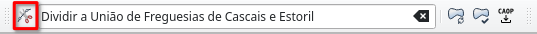
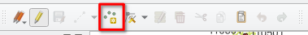
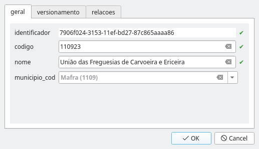

# Visualização e edição dos dados CAOP em QGIS

Para tornar a visualização e edição dos dados da CAOP de forma adequada e conveniente,
foram criados projectos QGIS para cada umas das regiões com Sistemas de Coordenadas de Referência diferentes:

* `projecto_caop_edicao_cont`
* `projecto_caop_edicao_ram`
* `projecto_caop_edicao_raa_oci`
* `projecto_caop_edicao_raa_cen_ori`

Os projectos estão guardados directamente na base de dados. Por uma questão de salvaguarda dos projectos, estes são *read-only* para os editores. Para efectuar alterações permanentes aos projectos é necessário usar o utilizador `administrador`.

## Configuração da ligação à base de dados

Tanto os dados, como os projectos de edição preparados são guardados na base de dados PostgreSQL/PostGIS. Por essa razão, para aceder aos mesmos através do QGIS, a primeira operação será estabelecer uma ligação à base de dados.

 1. Abrir o QGIS
 2. Se não estiver visível, activar o painel **Navegador** no menu **Configurações** > **Paineis** > **Navegador**
 3. No painel **Navegador**, clicar com o botão direito do rato sobre o item **PostgreSQL** e escolher a opção **Nova ligação**
 4. Na janela **Criar nova ligação PostGIS**, preencher os seguintes campos:
    * **Nome:** `CAOP Produção` ou `CAOP Testes`
    * **Máquina:** `192.168.10.102`
    * **Porta:** `5432`
    * **Base de dados:** `caop` ou `caop_testes`
 5. Ainda na janela **Criar nova ligação PostGIS**, na secção **Autenticação**, escolher o separador **Configurações** e clicar no botão **Criar nova configuração de autenticação**.
 6. Se exigido, escolha uma palavra-passe mestra. Esta será a única palavra-passe que terá de decorar quando precisar de aceder a projectos com necessidade de autenticação.

    
 7. Na janela **Autenticação**, junto ao **Id** clicar no símbolo do cadeado e
    preencher o campo com `dgtprod`
 8. Ainda na janela **Autenticação**, escolher\\preencher os seguintes campos:
    * **Nome:** `Nome à escolha` (e.g. Credenciais CAOP)
    * `Basic authentication`
    * **Utilizador:** `Nome do utilizador PostgreSQL` (e.g. `user1`)
    * **Palavra-passe:** `Password do utilizador` (e.g. `pass1`)
 9. Clicar em `Save`

    
10. De volta à janela **Criar nova ligação PostGIS**, clicar em **Testar ligação** para garantir que todos os dados de acesso estão correctos.
11. Garantir que pelo menos a opção **Permitir guardar e carregar projetos QGIS na base de dados** e clicar em **OK**

    

Agora no painel **Navegador** deverá ser possível visualizar a recém-criada ligação, clicando na mesma será possível visualizar o seu conteúdo.

## Instalação plugin CAOP Tools

Para auxiliar no processo de edição da CAOP e na geração dos conjuntos de dados finais, foi criado um plugin para QGIS com as seguintes funcionalidades:

* Pré-preenchimento do campo `motivo` nos campos editados
* Actualização dos conjuntos de dados finais no schema master, como base no estado actual da base de dados (trocos, centroides, etc...)
* Criar nova versão da CAOP
* Ferramenta de corte de troços CAOP

A instalação do plugin é feita através do arquivo Zip fornecido.

1. Abrir o gestor de plugins em **Plugins** > **Gerir e instalar plugins...**
2. Escolher o separador **Instalar de um ZIP**
3. Clicar no campo **ZIP file** clicar no botão **...** (Navegar) e indique o caminho até ao ficheiro `caop_tools_x.x.x.zip` fornecido.
4. Clicar em **Instalar módulo**.
5. Fechar a janela dos **Plugins**

   

## Edição dos dados CAOP

### Abrir projecto de Edição

A edição dos dados CAOP é feita através de quatro projectos de edição preparados para QGIS, um por cada região para que se trabalhe sempre no sistema de coordenadas correcto.

Os projectos de edição estão guardados na base de dados, dentro do schema `public`. Para abrir um projecto seguimos os seguinte passos:

1. Aceder ao painel **Navegador**
2. Expandir a ligação à base de dados criada de antemão
3. Expandir o schema `public`.
4. Fazer duplo-clique sobre o nome do projecto (e.g. `projecto_caop_edicao_cont`) ou simplesmente arrastando-o para a área do mapa.

   

Os projectos de edição estão organizados por grupos da seguinte forma:

* **validação** - camadas de apoio à validação topológica dos dados.
* **base - editável** - camadas que habitualmente sofrem alterações no processos de actualização da CAOP
* **base - estável** - Camadas pertencentes ao modelo de dados CAOP, mas cuja edição é mais rara.
* **master outputs** - Camadas geradas pelos scripts de outputs para o estado actual da base de dados CAOP
* **dominios** - tabelas auxiliares com listas de valores
* **versioning** - tabelas de backup associados ao sistema de histórico
* **basemaps** - camadas auxiliares de contexto

### Ligar Snapping

Sempre que se esteja a editar as geometrias da CAOP (em particular os troços) é importante garantir que a função de **snapping** está ligada. O snapping ajuda a garantir a coerência topológica entre os vários troços. Em QGIS, para ligar o snapping, seguimos os seguintes passos:

1. Se não estiver visível, ligar a barra de ferramentas **Snapping** em **Configurações** > **Barras de Ferramentas** > **Barra de Snapping**
2. Na barra de snapping, habilitar o snapping carregando no icon do iman.
3. Em termos de opções, no segundo botão da esquerda sugere-se o uso da **Camada activa** para apenas fazer snapping com elementos da camada `troco`. Caso se pretenda usar outras camadas como referência, sugere-se usar a opção **Configuração Avançada** e no botão **Editar Configuração Avançada** seleccionar apenas as camadas relevantes.
4. No terceiro botão da esquerda, deve~se usar só a opção **Vértices**

   

### Preencher o motivo

Na barra de Ferramentas **CAOP Tools** existe um campo de texto, onde se deve preencher o motivo da actual edição. Este texto é guardado automaticamente nos registos das tabelas, ajudando a descrever o histórico de cada registo.

### Execução de operações de edição comuns

#### Alterar geometria de uma fronteira (troço)

Uma das edições mais comuns é a alteração de uma fronteira entre duas freguesias. Para isso, é preciso isolar a secção do troço a alterar do restante, alterar a geometria do troço isolado e atribuir uma nova fonte ao troço alterado.

Neste processo, deve-se usar a ferramentas de **Dividir elementos** específica do plugin CAOP Tools. A ferramenta tem três características que a distingue da ferramenta nativa do QGIS:

* Sempre que um troço é cortado, são sempre atribuidos novos identificadores aos troços resultantes.
* O campo **troco_parente** é preenchido com o identificador do troço original, permitindo-nos manter uma relação de histórico com os novos troços.
* As fontes associadas ao troço original são replicadas a todos os novos troços.

##### Descrição passo a passo

 1. Na toolbar `CAOP tools`, editar o campo **Motivo** com a descrição das alterações se vão fazer (e.g. `Alteração de fronteira entre a freguesia de Alcabideche e São Domingos de Rana`)

    
 2. No Painel **Camadas**, seleccionar a camada `Fontes` e ligar a edição da mesma.

    
 3. Na **Barra de Digitalização**, clique no botão **Adicionar registo** para adicionar uma nova fonte.

    
 4. Preencha o formulário a informação relativa à nova fonte e clique em Ok.

    
 5. No Painel **Camadas**, seleccionar a camada `Troços` e ligar a edição da mesma.

    
 6. Com uma ferramenta de seleção (e.g. **Selecionar por área**), selecionar o troço a cortar (este passo não é obrigatório, mas pode ajudar a evitar cortes por engano de outros troços)

    
 7. Na toolbar `CAOP tools`, activar a ferramenta de corte do CAOP Tools

    
 8. Garantindo que o snapping está ligado, como descrito acima, com a ferramenta de corte por cima do mapa, desenhar (clicando com o botão esquerdo do rato para adicionar vertices) uma linha que atravesse o troço no local (ou locais) onde se pretende cortá-lo para isolar os segmentos do troço que irão ser alterados. Para terminar a linha clicar com o botão direito do rato. (Se possível, devemos cortar as linhas em vertices já existentes).

    

    **Nota 1:** Este passo pode ser feito através de vários cortes isolados.

    **Nota 2:** Ao desenhar, pode usar a tecla **Delete** para eliminar o último vértice introduzido.
 9. Usando novamente as ferramentas de seleção, seleccione o troço a ser alterado.

    
10. Usar as ferramentas do QGIS para alterar a geometria do novo troço, por exemplo:
    * **Ferramenta de vértices** (Barra de digitalização) que permite mover um ou mais vértices

      
    * **Editor de vértices** (Acesso através de clique direito do rato sobre o elemento quando a usar a **Ferramenta de vértices**) que permite editar as coordenadas de cada vértice.

      
    * **Redesenhar elementos** (Barra de digitalização avançada) que permite redesenhar um novo troço

      

    Para comprender o uso destas ferramentas em detalhes, sugere-se a consulta da documentação do QGIS:
    * [Ferramenta de vertices](https://docs.qgis.org/latest/pt_PT/docs/user_manual/working_with_vector/editing_geometry_attributes.html#vertex-tool)
    * [Editor de vértices](https://docs.qgis.org/latest/pt_PT/docs/user_manual/working_with_vector/editing_geometry_attributeshtml#the-vertex-editor-panel)
    * [Redesenhar elementos](https://docs.qgis.org/latest/pt_PT/docs/user_manual/working_with_vector/editing_geometry_attributes.html#reshape-features)

    **Nota:** Todas estas ferramentas devem ser usadas com auxílio das ferramentas de snapping, inclusivamente a opção de tracejamento que permite desenhar com rapidez usando outras camadas como referência.
11. De seguida, vamos editar as fontes dos troços alterados. Na **Barra de attributos** clicar em **Abrir tabela de atributos (Editados e Novos Elementos)**.

    
12. Na **tabela de atributos** da camada `troço`, clicar em  **Mudar para vista para modo de formulário**. Clicar sobre o o elemento cuja geometria foi alterada (em principio ainda estará selecionado). De seguida, selecionar o separador `fontes`.

    
13. No separador `Fontes`, activar a edição, selecionar as fontes existentes e apagá-las.

    
14. Ainda no separador **Fontes**, clicar em **Adicionar elemento filho** e para o campo `fonte_id`escolher a fonte criada no passo 2 a 5. A forma mais simples de encontrar a fonte é iniciar a escrever a data ou a descrição (e.g. `135/2024`) até que a fonte correcta apareça. Clicar em **Ok**

    
15. Feitas e confirmadas todas as alterações é preciso gravar as camadas editadas, para que as modificações sejam enviadas para a base de dados. Devido às relações de dependência das camadas, as alterações à camada `lig_troco_fonte` devem ser as última a serem gravada. Uma forma prática de gravar todas as alterações e desligar a edição é, na **Barra de digitalização**, escolher a opção **Guardar para todas as camadas**, seguida de **Cancelar para Todas as Camadas**

    

#### Dividir uma freguesia (área administrativa) em dois

Outra tipo de edição comum é a divisão da área de uma freguesia (área administrativa) em duas (ou mais) novas freguesias. Este processo implica:

* Criar novas entidades administrativas
* Criar uma nova fonte
* Desenhar novos troços que representem as linhas de fronteira entre as freguesias a criar, garantindo a coerência topológica com troços já existentes
* Atribuir a nova fonte a todos os troço criados ou alterados
* Adicionar novos centroides nas freguesias e eliminar os antigos

#### Descrição passo a passo

1. Na toolbar `CAOP tools`, editar o campo **Motivo** com a descrição das alterações se vão fazer (e.g. `Dividir a União de Freguesias de Cascais e Estoril`)

   

2. No Painel **Camadas**, seleccionar a camada `Fontes` e ligar a edição da mesma.

    
3. Na **Barra de Digitalização**, clique no botão **Adicionar registo** para adicionar uma nova fonte.

    
4. Preencha o formulário a informação relativa à nova fonte e clique em Ok.

    

5. No Painel **Camadas**, seleccionar a camada `Troços` e ligar a edição da mesma.

    

6. Na **Barra de digitalização** seleccionar a ferramenta **Adicionar elemento linha**

    
7. Garantindo que o snapping está ligado, como descrito acima, desenhar sobre o mapa (clicando com o botão esquerdo do rato para adicionar vertices) uma linha que represente a nova fronteira. Para terminar a linha clicar com o botão direito do rato.

   

   **Nota:** Alternativamente, se disponível, podemos copiar a linha de uma camada auxiliar para dentro da camada troço através usando os botões de copy-paste da **Barra de digitalização**

    
 8. Preencher o formulário do novo troço. Para o campo nivel_limite_administrativo escolher `Não aplicável`. Clicar em **OK**.

    
 9. Fazer Zoom In nas zonas de intersecção do novo troço com troços existentes.
10. Com uma ferramenta de seleção (e.g. **Selecionar por área**), selecionar o troço existente a cortar (este passo não é obrigatório, mas pode ajudar a evitar cortes por engano de outros troços)

    
11. Na toolbar `CAOP tools`, activar a ferramenta de corte do CAOP Tools.

    

12. Garantindo que o snapping está ligado, como descrito acima, com a ferramenta de corte por cima do mapa, desenhar (clicando com o botão esquerdo do rato para adicionar vertices) uma linha que atravesse o troço no local em que este intersecta com o troço novo. Para terminar a linha clicar com o botão direito do rato. (Se possível, devemos cortar as linhas em vertices já existentes).

    

13. Com zoom elevado, garantir que os três vertices são coindidentes. Se não forem coincidentes, usar a ferramenta **Ferramenta de vértices** (Barra de digitalização) para mover o vértice do novo troço para coincidir com o outros dois vértices recém criados pela ferramenta de corte.

    

14. Repetir os últimos 5 passos para a outra extremidade do novo troço.

15. De seguida, vamos adicionar a nova fonte a todos os troços alterados. Mantendo a camada `troço`activa, na **Barra de attributos** clicar em **Abrir tabela de atributos (Editados e Novos Elementos)**.

    

16. Na **tabela de atributos** da camada `troço`, clicar em  **Mudar para vista para modo de formulário**. Clicar sobre um dos elementos troço alterados. De seguida, selecionar o separador `fontes`.

    

17. Ainda no separador **Fontes**, clicar em **Adicionar elemento filho** e para o campo `fonte_id`escolher a fonte criada anteriormente. A forma mais simples de encontrar a fonte é iniciar a escrever a data ou a descrição (e.g. `666/2024`) até que a fonte correcta apareça. Clicar em **Ok**

    

18. Repetir o passo anterior para todos os troços. No final, todos os troços alterados devem conter a nova fonte. Fechar a tabela de atributos.

    

19. Esta é uma boa altura para gravar as alterações feitas. Devido às relações de dependência das camadas, as alterações à camada `lig_troco_fonte` devem ser as última a serem gravada. Uma forma prática de gravar todas as alterações e desligar a edição é, na **Barra de digitalização**, escolher a opção **Guardar para todas as camadas**, seguida de **Cancelar para Todas as Camadas**

    

20. De seguida, vamos criar e editar todos os centroides necessário de forma a que cada área administrativa tenha um centroide, mas primeiro teremos de criar as entidades administrativas na tabela alfanumérica. No Painel **Camadas**, seleccionar a camada `entidade_Administrativa` e ligar a edição da mesma.

    

21. Na **Barra de Digitalização**, clique no botão **Adicionar registo** para adicionar uma nova entidade administrativa.

    

22. Preencher o formulário a informação relativa à nova entidade administrativa e clique em Ok.

    

23. Repetir os dois passos anteriores por cada nova entidade administrativa (Freguesia) a criar.

24. Agora, é necessário procurar e eliminar a entidade administrativa obsoleta. Na **Barra de atributos** clicar no botão **Abrir tabela de atributos**.

    

25. No canto inferior esquerdo da tabela de atributos selecionar **Mostrar todos os elemento** > **Filtro de Campos** > **Nome**

    

26. Usando o campo de filtro, podemos escrever por um termo a procurar (e.g. `Cascais`) e carregamos em `Enter`. Isto irá filtrar aos elementos que contenham esse termo. Depois podemos selecionar o elemento e carregar no botão eliminar.

    

27. No Painel **Camadas**, seleccionar a camada `centroides_ea` e ligar a edição da mesma.

    

28. Na **Barra de Digitalização**, clique no botão **Adicionar elemento ponto** para adicionar um centroide em falta (e.g. o centroide da freguesia do Estoril). Clicando depois no mapa para adicionar o ponto para a área administrativa em falta.

    

29. Preencher o formulário a informação relativa ao novo centroide com a entidade administrativa respectiva e clique em OK.

    

30. No Caso da existencia de centroides que já sirvam para identificar àreas administrativas, podemo apenas mudar-lhe a entidade administrativa. Com uma ferramenta de seleção (e.g. **Selecionar por área**), selecionar todos os centroides a alterar a entidade.

    

31. Na **Barra de Digitalização**, clique no botão **Alterar simultâneamente atributos dos elementos selecionados**

    

32. No formulário, alterar o campo `Entidade administrativa` para a nova entidade. Não alterar o campo `Tipo de área administrativa`. Clicar em OK.

    

33. Já só falta gravar as última alterações. Devido às relações de dependência das camadas é necessário gravar primeiramente a camada `Entidades administrativas`e só depois a camada `centroides_ea`.

### Unir duas (ou mais) áreas administrativas

Outro processo comum será a união de freguesias. De forma resumida, é necessário:

* Registar uma nova fonte que justifique a alteração
* Adicionar uma nova entidade administrativa que una as entidades anteriores
* Adicionar um centroide de identificação da nova área administrativa
* Eliminar os troços e centroides obsoletos
* ?? Atribuir a nova fonte a todos os troços que delimitam a nova area administrativa??

#### Descrição passo a passo

1. Na toolbar `CAOP tools`, editar o campo **Motivo** com a descrição das alterações se vão fazer (e.g. `Criar União das Freguesias da Carvoeira e Ericeira`)

   

2. No Painel **Camadas**, seleccionar a camada `Fontes` e ligar a edição da mesma.

   

3. Na **Barra de Digitalização**, clique no botão **Adicionar registo** para adicionar uma nova fonte.

   

4. Preencha o formulário a informação relativa à nova fonte e clique em Ok.

   

5. No Painel **Camadas**, seleccionar a camada `entidade_Administrativa` e ligar a edição da mesma.

    

6. Na **Barra de Digitalização**, clique no botão **Adicionar registo** para adicionar uma nova entidade administrativa.

   

6. Preencher o formulário com a informação relativa à nova entidade administrativa e clique em Ok.

   

15. No Painel **Camadas**, seleccionar a camada `centroides_ea` e ligar a edição da mesma.

    

16. Na **Barra de Digitalização**, clique no botão **Adicionar elemento ponto** para adicionar um centroide em falta (e.g. o centroide da nova união de freguesias). Clicando depois no mapa para adicionar o ponto para a área administrativa em falta.

    

17. Preencher o formulário a informação relativa ao novo centroide com a entidade administrativa respectiva e clique em OK.

    

18. Gravar todos os novos elementos na base de dados. Por uma questão de dependência das camadas, devemos começar por gravar a camada da entidade administrativa. Assim, pela seguinte ordem, activar as camadas `entidade_administrativa`, `fontes`, `centroides_ea` e na **Barra de digitalizaçáo** clicar em **Guardar alterações à camada**.

    

19. Com a camada `centroides_ea` activa, usar uma qualquer ferramenta de selecçao (e.g. **Selecionar por area**), seleccionar os centroides obsoletos e clicar em **Eliminar selecionados**. Por fim, gravar as alterações à camada.

    

5. No Painel **Camadas**, seleccionar a camada `Troços` e ligar a edição da mesma.

    

6.  Com a camada `troço` activa, usar uma qualquer ferramenta de selecçao (e.g. **Selecionar por area**), seleccionar o troço ou troços que compunham a fronteira entre as duas áreas administrativas e clicar em **Eliminar selecionados**. Por fim, gravar as alterações à camada.

    

**Nota:** Faltará ainda eliminar as entidades administrativas obsoletas. No entanto, esse passo apenas pode ser executado após actualização dos conjuntos de dados finais, uma vez que esse processo irá refazer as relações entre a nova entidade administrativa e os troços que a delimitam, e assim "libertar" entidade administrativa obsoleta. Este processo é explicado na secção seguinte.

## Gerar ou actualizar conjuntos de dados finais

Após quaisquer processos de edição, na barra **CAOP Tools**, deve-se correr a ferramentas de **Actualizar Outputs Master** para confirmar os resultados.

1. Escolher a ligação à base de dados desejada
2. Escolher a Região que se está a editar
3. Carregar em Executar

Esta ferramenta actualiza as camadas de output CAOP, para os dados actuais, no schema `master`.

## Validar Outputs

Após actualizar os outputs, é essencial garantir a sua coerência geomética e topológica das edições.

Para tal, no barra de ferramentas CAOP Tools, carregar no botão **Actualizar Validações**.

1. Escolher a ligação à base de dados desejada
2. Escolher a Região que se está a editar
3. Carregar em Executar

Esta ferramenta actualiza as camadas existentes no grupo **Validação**.

Cada camada representa um erro específico. O número no final indica o número de erros encontrados.

* `trocos_geometria_invalida` - Erros de geometria na camada trocos, comprimento 0, vertices duplicados.
* `trocos_dangle` -  Fins ou inicios de troços que não estão conectados a mais nenhum troço
* `trocos_cruzado` - Troços que cruzam outros troços sem que haja um corte ou que estão sorepostos em algum segmento
* `trocos_duplicado` -  Troços exactamente iguais e sobrepostos
* `centroides_duplicado` - centroides iguais no mesmo local
* `poligonos_temp_erro` - Polígonos sem centroide dentro ou com mais que um centroide (geralmente relacionado com algum dangle)
* `diferencas_geom_gerado_publicado` - Mostra a diferença em termos de geometrias (polígonos) entre a versão de output e uma camada de referência (neste caso, a CAOP Publicada)

### Gerar output CAOP

Uma vez satisfeitos com as alterações, e no caso de querermos guardar os resultados num schema que não o `master`, podemos usar a ferramenta **Gerar CAOP**.

1. Escolher a ligação à base de dados desejada
2. Escolher o Schema
3. Escolher a Região que se está a editar
4. Na data, indicar o dia de amanhã
5. Carregar em executar

NOTA: Esta ferramenta pode ser usada para ver os estado da CAOP numa data anterior à actual, bastando para isso colocar uma data diferente. Também se pode escolher uma versão anterior.

Caso se pretenda, podemos executar esta ferramenta em modo de execução em lote para todas as regiões.

### Criar versão CAOP

Executadas todas as alterações necessárias para aquele ano, é conveniente registar uma nova versão CAOP. Esse registo é feito através data tabela `versioning.versao`.

1. No grupo versioning, carregar com o botão direito do rato na camada e escolher **Abrir tabela de atributos**.
2. Ligar a edição da camada e clicar no botão **Adicionar elemento**
3. Preencher o formulário e clicar em OK

   

4. Gravar a camada

Para gerar o output para esta versão, podemos usar o nome da versão na ferramenta Gerar CAOP em vez de uma data.

