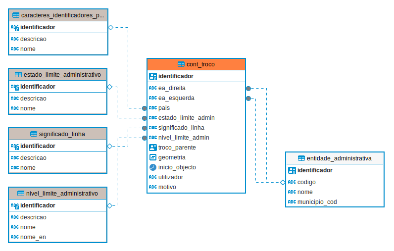
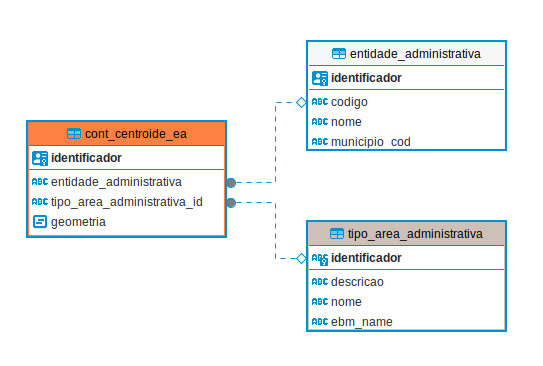
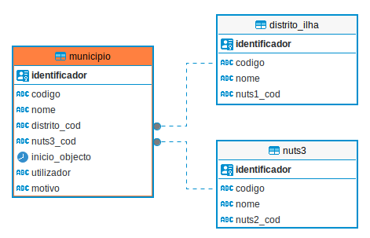
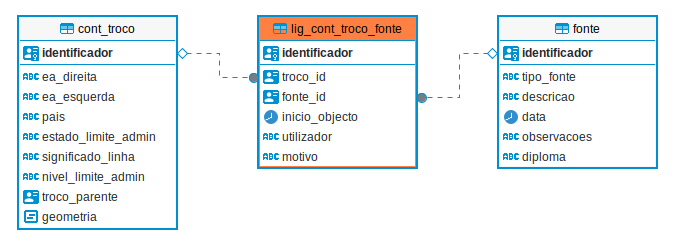
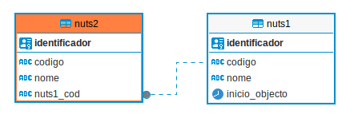
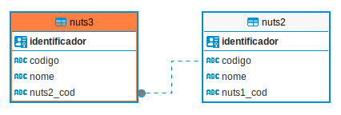

# Implementação do modelo em PostgreSQL/PostGIS (schemas, dominios, tabelas e atributos)

A implementação do modelo conceptual foi feita em PostgreSQL/PostGIS. Os scrips usados foram os seguintes:

* `00_modelo_dados_caop.sql`
* `01_sistema_de_versionamento.sql`
* `02_preenchimento_tabelas_de_valores.sql`

Nesta secção descreve-se os principais schemas do modelo implementado, as respectivas tabelas e atributos.

O modelo conceptual foi distribuído por dois schemas `dominios` e `base`.

## Schema `dominios`

No schema `dominios` são guardadas todas as tabelas referentes às listas de valores usados em alguns campos das tabelas do schema `base`.

**Nota**: As tabelas deste schema só são editaveis por utilizadores do grupo `administrador`

### Tabela `dominios.caracteres_identificadores`

Descrição dos atributos da tabela:

| Coluna        | Tipo         | Restrições  |
|---------------|--------------|-------------|
| identificador | varchar(5)   | PRIMARY KEY |
| descricao     | varchar      | NOT NULL    |
| nome          | varchar(100) |             |

Valores possíveis:

| identificador | descricao                                                                         | nome             |
|---------------|-----------------------------------------------------------------------------------|------------------|
| PT            | Troço de limite que envolve apenas divisão administrativa em território português | Portugal         |
| PT#ES         | Troço de limite que pertence à fronteira internacional entre Portugal e Espanha   | Portugal#Espanha |

### Tabela `dominios.estado_limite_administrativo`

Descrição dos atributos da tabela:

| Coluna        | Tipo         | Restrições  |
|---------------|--------------|-------------|
| identificador | varchar(3)   | PRIMARY KEY |
| descricao     | varchar      | NOT NULL    |
| nome          | varchar(100) |             |

Valores possíveis:

| identificador | Descrição                                                                                | Nome           |
|---------------|------------------------------------------------------------------------------------------|----------------|
| 1             | Troço de limite obtido a partir de procedimentos realizados para o efeito.               | Definido       |
| 2             | Troço de limite por definir entre as partes                                              | Por Acordar    |
| 3             | Troço de limite que não se encontra aceite pelas partes                                  | Não Acordado   |
| 4             | Troço de limite cuja aceitação pelas partes ainda não foi comunicada oficialmente        | Não Confirmado |
| 998           | Linha que define exclusivamente parte de um limite, e que se encontra localizado na água | Não Aplicável  |

### Tabela `dominios.nivel_limite_administrativo`

Descrição dos atributos da tabela:

| Coluna        | Tipo         | Restrições  |
|---------------|--------------|-------------|
| identificador | varchar(3)   | PRIMARY KEY |
| descricao     | varchar      | NOT NULL    |
| nome          | varchar(100) |             |
| nome_en       | varchar(100) |             |

Valores possíveis:

| identificador | descricao                                            | nome          | nome_en        |
|---------------|------------------------------------------------------|---------------|----------------|
| 1             | Nível superior da hierarquia administrativa nacional | 1ª Ordem      | 1stOrder       |
| 2             | Segundo nível na hierarquia administrativa nacional  | 2ª Ordem      | 2ndOrder       |
| 3             | Terceiro nível na hierarquia administrativa nacional | 3ª Ordem      | 3rdOrder       |
| 4             | Quarto nível na hierarquia administrativa nacional   | 4ª Ordem      | 4thOrder       |
| 5             | Quinto nível na hierarquia administrativa nacional   | 5ª Ordem      | 5thOrder       |
| 6             | Sexto nível na hierarquia administrativa nacional    | 6ª Ordem      | 6thOrder       |
| 998           | Nível desconhecido ou indefinido                     | Não Aplicável | Non Applicable |

Esta tabela inclui a tradução do nome para inglês por ser útil para produção de *outputs* do EuroBoundaries e Inspire.

### Tabela `dominios.significado_linha`

Descrição dos atributos da tabela:

| Coluna        | Tipo         | Restrições  |
|---------------|--------------|-------------|
| identificador | varchar(3)   | PRIMARY KEY |
| descricao     | varchar      | NOT NULL    |
| nome          | varchar(100) |             |

Valores:

| Identificador | Descrição                                                                 | Nome                    |
|---------------|---------------------------------------------------------------------------|-------------------------|
| 1             | Linha que define, simultaneamente, parte de um limite e de linha de costa | Limite e Linha de Costa |
| 2             | Linha que define exclusivamente a linha de costa                          | Linha de Costa          |
| 7             | Linha que define um limite que se localiza em terra                       | Limite em Terra         |
| 9             | Linha que define um limite que se localiza apenas em massa de água        | Limite na Água          |

### Tabela `dominios.tipo_area_administrativa`

Descrição dos atributos da tabela:

| Coluna        | Tipo         | Restrições  |
|---------------|--------------|-------------|
| identificador | varchar(3)   | PRIMARY KEY |
| descricao     | varchar      | NOT NULL    |
| nome          | varchar(100) | NOT NULL    |
| ebm_name      | varchar(100) |             |

Valores:

| Identificador | Descrição                                                                                              | Nome                       |
|---------------|--------------------------------------------------------------------------------------------------------|----------------------------|
| 1             | Área principal da entidade administrativa, e que coincidirá com a localização da sede de freguesia     | Área Principal             |
| 3             | Área geometricamente separada de uma área principal                                                    | Área Secundária            |
| 4             | Área que tem uma competência específica                                                                | Área Especial              |
| 5             | Área, que engloba uma massa de água, e que se encontra fora de terra                                   | Área Costeira              |
| 7             | Área que se encontra longe de limites de costa, mas que engloba uma massa de água de grandes dimensões | Área de “Águas Interiores” |

### Tabela `dominios.tipo_fonte`

Descrição dos atributos da tabela:

| Coluna        | Tipo         | Restrições  |
|---------------|--------------|-------------|
| identificador | varchar(3)   | PRIMARY KEY |
| descricao     | varchar      | NOT NULL    |
| nome          | varchar(100) |             |

Valores:

| Identificador | Descrição                                                                                                                                                                                                                                                                                                 | Nome                                                                              |
|---------------|-----------------------------------------------------------------------------------------------------------------------------------------------------------------------------------------------------------------------------------------------------------------------------------------------------------|-----------------------------------------------------------------------------------|
| 1             | Norma jurídica redigida por entidade oficial competente publicada e posteriormente impressa na publicação oficial portuguesa                                                                                                                                                                              | Lei                                                                               |
| 2             | Ferramenta legislativa usada pelo poder executivo para legislar sobre matéria na qual é competente, sendo obrigatoriamente posterior alvo de publicação no jornal oficial português                                                                                                                       | Decreto-Lei                                                                       |
| 3             | Ordem publicada no jornal oficial português, que foi emanada por autoridade superior ou órgão que determina o cumprimento de uma resolução                                                                                                                                                                | Decreto                                                                           |
| 4             | Documento administrativo de qualquer autoridade pública, publicado no jornal oficial português, que contém instruções acerca da aplicação de leis ou regulamentos, recomendações de carácter geral, normas de execução, nomeações, demissões, punições, ou qualquer outra determinação da sua competência | Portaria                                                                          |
| 5             | Documento administrativo de qualquer autoridade pública, publicado no jornal oficial português, que contém a indicação de alterações, em número reduzido, ao teor de uma lei, decreto-lei, decreto ou outro texto oficial outrora publicado, e na qual se encontram omissões ou incorreções               | Retificação                                                                       |
| 6             | Ato de um juiz de um tribunal administrativo português que extingue o processo decidindo determinada questão posta em juízo, decidindo sobre o ato administrativo, resolvendo o conflito de interesses que suscitou a abertura do processo entre as entidades públicas                                    | Acção Administrativa Comum                                                        |
| 7             | Ato de um juiz de um tribunal administrativo português que extingue o processo decidindo determinada questão posta em juízo, resolvendo o conflito de interesses que suscitou a abertura do processo entre as partes                                                                                      | Sentença de Tribunal Administrativo                                               |
| 8             | Conjunto de trabalhos técnicos conducentes ao estabelecimento de um determinado limite administrativo                                                                                                                                                                                                     | Procedimento Delimitação Administrativa                                           |
| 9             | Dados cartográficos, que foram capturados, manipulados e disponibilizados pelo Instituto Geográfico do Exército, de acordo com as competências legalmente incumbidas a esta instituição                                                                                                                   | Dados Instituto Geográfico do Exército                                            |
| 10            | Dados cartográficos que foram capturados e manipulados pela Direção-Geral do Território, ou por instituição antecedente, com o intuito de caracterizar administrativamente os prédios de acordo com as especificações técnicas definidas para o cadastro geométrico da propriedade rústica                | Cadastro Geométrico da Propriedade Rústica                                        |
| 11            | Dados cartográficos recolhidos, manipulados e disponibilizados, com finalidade estatística, de acordo com as especificações técnicas estabelecidos para o momento censitário Censos 2001, da responsabilidade do Instituto Nacional de Estatística                                                        | Censos 2001                                                                       |
| 12            | Documento administrativo de qualquer autoridade pública, publicado no jornal oficial português, onde constam dados relacionados com outro diploma legal                                                                                                                                                   | Declaração                                                                        |
| 13            | Ferramenta legislativa usada pelo poder executivo para legislar sobre matéria na qual é competente, no domínio da autonomia regional, sendo obrigatoriamente posterior alvo de publicação no jornal oficial português                                                                                     | Decreto Legislativo Regional                                                      |
| 14            | Dados cartográficos que foram capturados, manipulados e disponibilizados pela Região Autónoma da Madeira, de acordo com as competências legalmente incumbidas a esta instituição                                                                                                                          | Dados da Direção Regional do Ordenamento do Território e Ambiente (R. A. Madeira) |
| 15            | Documento administrativo enviado por uma autarquia, enviado à Direção-Geral do Território, que contém a indicação de alterações a um ou mais troços de limites administrativos da entidade administrativa envolvida                                                                                       | Ofício                                                                            |
| 16            | Dados cartográficos que foram capturados, manipulados e disponibilizados pela Região Autónoma da Madeira, de acordo com as competências legalmente incumbidas a esta instituição                                                                                                                          | Dados da Direção Regional do Ordenamento do Território (R. A. Madeira)            |
| 17            | Dados cartográficos, que foram capturados, manipulados e disponibilizados pelo Instituto                                                                                                                                                                                                                  |                                                                                   |

### Tabela `dominios.tipo_sede_administrativa`

Esta tabela foi criada com base na tabela `DesignacaoLocal` do modelo de dados **CartTop** para facilitar a importação de dados da mesma para a CAOP.

Descrição dos atributos da tabela:

| Coluna        | Tipo         | Restrições  |
|---------------|--------------|-------------|
| identificador | varchar(1)   | PRIMARY KEY |
| descricao     | varchar      | NOT NULL    |
| nome          | varchar(100) | NOT NULL    |

Valores:

| Identificador | Descrição                              | Nome                                                                       |
|---------------|----------------------------------------|----------------------------------------------------------------------------|
| 1             | Capital do País                        | Cidade onde está situada a sede administrativa do país.                    |
| 2             | Sede administrativa de Região Autónoma | Cidade onde está situada a sede administrativa da Região Autónoma.         |
| 3             | Capital de Distrito                    | Cidade onde está situada a sede administrativa do distrito.                |
| 4             | Sede de Concelho                       | Lugar onde está instalada a Câmara Municipal e que dá o nome ao município. |
| 5             | Sede de Freguesia                      | Lugar onde está instalada a freguesia e que dá o nome à mesma.             |

## Schema `base`

No schema `base` são guardadas todas as tabelas editáveis que permitem a edição e gestão da CAOP. Estas são as tabelas de trabalho para os editores da CAOP.

Por questões de gestão dos diferentes sistemas de coordenadas, optou-se por separar algumas entidades em diferentes tabelas espaciais (com colunas de geometria), nomeadamente `centroide_ea` e `troco` pelas quatro regiões com prefixos e códigos EPSG distintos:

* `_cont` - Continente (EPGS: 3763)
* `_ram` - Região Autónoma da Madeira (EPSG: 5016)
* `_raa_oci` - Região Autónoma dos Açores, Grupo Ocidental (EPSG: 5014)
* `_raa_cen_ori` - Região Autónoma dos Açores, Grupo Central e Oriental (EPSG: 5015)

Dada a relação de muitos para muitos (n:m) entre os troços e as fontes também as tabelas auxiliares tiveram de ser separadas por regiões (`lig_cont_troco_fonte`, `lig_ram_troco_fonte`, `lig_raa_oci_troco_fonte`, `lig_raa_cen_ori_troco_fonte`)

**Nota:** Na documentação, por uma questão de simplicidade e por se tratar de informação redundante, estas tabelas com prefixos são descritas apenas uma vez.

A tabela `sede_administrativa`, geométrica do tipo ponto, visto ser apenas usada para gerar outputs do euroBoundaries e INSPIRE, e não requerendo uma precisão posicional elevada, optou-se por manter apenas uma única tabela no sistema global EPSG:4258.

As restantes tabelas são não espaciais, sem prefixos e são consideradas globais.

Na descrição abaixo apenas se descreve as tabelas identicas um vez, sendo a estrutura idêntica globalmente

### Tabelas `base.troco`

A implementação da entidade `Troço` é feita pelas seguintes tabelas:

* `base.troco_cont`
* `base.troco_ram`
* `base.troco_raa_oci`
* `base.troco_raa_cen_ori`

Cada registo destas tabelas representa um troço de delimitação entre duas entidades
administrativas ou o limite de uma entidade administrativa com o oceano Atlantico ou Espanha.

Em termos geométricos, os troços são representados por linhas simples. Em termos topológicos, entre dois troços, não são permitidas sobreposição dos interiores das geometrias. Ou seja, apenas os inícios e fins das *linestrings* (a *boundary* da geometria) podem tocar outros troços. Também é considerado erro topológico quando o inicio ou fim
de um troço não se conecta a pelo menos um outro troço. Exceção feita a troços fechados.

#### Descrição dos atributos

| Nome da Coluna      | Tipo de Dados        | Not Null | Referência (Coluna)                                      | Restrições  |
|---------------------|----------------------|----------|----------------------------------------------------------|-------------|
| identificador       | uuid                 | Sim      |                                                          | PRIMARY KEY |
| ea_direita          | varchar(8)           | Não      | base.entidade_administrativa (codigo)                    |             |
| ea_esquerda         | varchar(8)           | Não      | base.entidade_administrativa (codigo)                    |             |
| pais                | varchar(5)           | Não      | dominios.caracteres_identificadores_pais (identificador) |             |
| estado_limite_admin | varchar(3)           | Não      | dominios.estado_limite_administrativo (identificador)    |             |
| significado_linha   | varchar(3)           | Não      | dominios.significado_linha (identificador)               |             |
| nivel_limite_admin  | varchar(3)           | Não      | dominios.nivel_limite_administrativo (identificador)     |             |
| troco_parente       | uuid                 | Não      |                                                          |             |
| geometria           | geometry(linestring) | Não      |                                                          |             |

#### Diagram relacional



### Tabela `base.centroide_ea`

A entidade `Centroide EA` é implementada nas seguintes tabelas:

* `base.centroide_ea_cont`
* `base.centroide_ea_ram`
* `base.centroide_ea_raa_oci`
* `base.centroide_ea_raa_cen_ori`

Cada registo nestas tabelas representa o centro (não obrigatoriamente geométrico)
de uma área administrativa. Cada área administrativa, que assume posteriormente a
forma de um polígono, representa uma área desconexa de uma entidade administrativa (freguesia ou união de freguesias).

Em termos topológico, dentro de cada área administrativa deve existir apenas um
centroide. A inexistencia de centroide, ou a sua multiplicidade é considerado um erro. Impedindo a correcta criação dos polígonos CAOP.

#### Descrição dos atributos

| Nome da Coluna              | Tipo de Dados                | Not Null | Referência (Coluna)                               | Restrições  |
|-----------------------------|------------------------------|----------|---------------------------------------------------|-------------|
| identificador               | uuid                         | Sim      |                                                   | PRIMARY KEY |
| entidade_administrativa     | varchar(8)                   | Não      | base.entidade_administrativa (codigo)             |             |
| tipo_area_administrativa_id | varchar(3)                   | Não      | dominios.tipo_area_administrativa (identificador) |             |
| geometria                   | public.geometry(point, 3763) | Sim      |                                                   |             |

#### Diagram relacional



### Tabela `base.entidade_administrativa`

Implementação da entidade Entidade administrativa. Os registos desta tabela alfanumérica representam as unidades administrativas de nível 5, o mais baixo (freguesias ou uniões de freguesias). As entidades administrativas (EA) são identificadas
inequivocamente através de um código único (DICOFRE ou DTMNFR). São ainda
incluídas as entidades *Oceano Atlântico* e *Espanha*. Para além do nome da entidade administrativa, é também identificada a unidade administrativa de nível superior a que pertence (município).

Uma restrição garante que o código único da entidade administrativa é compatível com o código do município identificado.

#### Descrição dos atributos

| Nome da Coluna | Tipo de Dados | Not Null | Referência (Coluna)     | Restrições                               |
|----------------|---------------|----------|-------------------------|------------------------------------------|
| identificador  | uuid          | Sim      |                         | PRIMARY KEY                              |
| codigo         | varchar(8)    | Sim      |                         | UNIQUE (entidade_administrativa_cod_key) |
| nome           | varchar       | Sim      |                         |                                          |
| municipio_cod  | varchar(4)    | Não      | base.municipio (codigo) | CHECK dtmnfr_dtmn_compativeis            |

#### Diagram relacional


### Tabela `base.municipio`

Implementação da entidade Municipio. Os registos desta tabela alfanumérica representam a unidades administrativas de nível 4, os municípios. Os municípios são identificados
inequivocamente através de um código único (DICO ou DTMN). Para além do nome da entidade administrativa, é também identificada a unidade administrativa superior (distrito ou ilha) e a unidade estatística (NUTS3) a que pertence.

#### Descrição dos atributos

| Nome da Coluna | Tipo de Dados | Not Null | Referência (Coluna)     | Restrições |
|----------------|--------------|----------|-----------------------------|-----------------------------|
| identificador  | UUID         | Yes      |                             | PRIMARY KEY                 |
| codigo         | VARCHAR(4)   | Yes      |                             | UNIQUE (municipio_dico_key) |
| nome           | VARCHAR      | Yes      |                             |                             |
| distrito_cod   | VARCHAR(2)   | Yes      | base.distrito_ilha (codigo) | CHECK dtmn_dt_compativeis                            |
| nuts3_cod      | VARCHAR(5)   | Yes      | base.nuts3 (codigo)         |                             |

Uma restrição garante que o código único do município é compatível com o código do distrito ou ilha identificado.

#### Diagrama relacional



### Tabela `base.distrito_ilha`

Implementação da entidade Distrito_Ilha

Os registos desta tabela alfanumérica representam a unidades administrativas de nível 3, os distritos e ilhas das regiões autónomas. Os distritos são identificados
inequivocamente através de um código único (DI ou DT). Para além do nome da entidade administrativa, salienta-se a identificação da unidade estatística (NUTS1) a que pertence.

#### Descrição dos atributos

| Nome da Coluna     | Tipo de Dados         | Not Null | Referência (Coluna)       | Restrições                              |
|--------------------|-----------------------|----------|---------------------------|----------------------------------------|
| identificador      | uuid                  | Sim      |                           | PRIMARY KEY                            |
| codigo             | varchar(2)            | Sim      |                           | UNIQUE (distrito_ilha_di_key)          |
| nome               | varchar               | Sim      |                           |                                        |
| nuts1_cod          | varchar(3)            | Sim      | base.nuts1 (codigo)       |                                        |


#### Diagrama relacional


### Tabela `base.fonte`

Os registos desta tabela alfanumérica representam fontes (Decreto-Lei, Cadastro, etc...) na origem da delimitação dos troços existentes na tabela `base.troco`.

#### Descrição dos atributos (base.fonte)

| Nome da Coluna     | Tipo de Dados         | Not Null | Referência (Coluna)       | Restrições                              |
|--------------------|-----------------------|----------|---------------------------|----------------------------------------|
| identificador      | uuid                  | Sim      |                           | PRIMARY KEY                            |
| tipo_fonte         | varchar(3)            | Não      | dominios.tipo_fonte (identificador) |                                   |
| descricao          | varchar(255)          | Não      |                           |                                        |
| data               | date                  | Não      |                           | DEFAULT now()                          |
| observacoes        | varchar               | Não      |                           |                                        |
| diploma            | varchar(255)          | Não      |                           |                                        |


#### Diagrama relacional


A entidade `fonte` estabelece uma relação de N:M com a entidade `troco`, onde um troço pode ter origem em várias fontes e a mesma fonte pode estar na origem de diferentes troços. Esta relação é implementa através das seguintes tabelas auxiliares:

* `base.lig_troco_cont_fonte`
* `base.lig_troco_ram_fonte`
* `base.lig_troco_raa_oci_fonte`
* `base.lig_troco_raa_cen_ori_fonte`


#### Descrição dos atributos (`lig_troco_fonte`)

| Nome da Coluna     | Tipo de Dados         | Not Null | Referência (Coluna)              | Restrições                              |
|--------------------|-----------------------|----------|----------------------------------|----------------------------------------|
| identificador      | uuid                  | Sim      |                                  | PRIMARY KEY                            |
| troco_id           | uuid                  | Não      | base.cont_troco (identificador)  | ON DELETE CASCADE                      |
| fonte_id           | uuid                  | Não      | base.fonte (identificador)       |                                        |

#### Diagrama relacional ligação N:M (Exemplo Continente)



### Tabela `base.nuts1`

Os registos desta tabela alfanumérica representam a Nomenclatura das Unidades Territoriais para Fins Estatísticos (NUTS - *Nomenclature of Territorial Units for Statistics*) de nível 1.

#### Descrição dos atributos

| Nome da Coluna     | Tipo de Dados         | Not Null | Referência (Coluna) | Restrições                    |
|--------------------|-----------------------|----------|---------------------|------------------------------|
| identificador      | uuid                  | Sim      |                     | PRIMARY KEY                  |
| codigo             | varchar(3)            | Sim      |                     | UNIQUE (codigo)              |
| nome               | varchar               | Sim      |                     | UNIQUE (nome)                |

### Tabela `base.nuts2`

Os registos desta tabela alfanumérica representam a Nomenclatura das Unidades Territoriais para Fins Estatísticos (NUTS - *Nomenclature of Territorial Units for Statistics*) de nível 2.

Para além do código e nome da NUTS, salienta-se a indicação da NUTS de nivel superior a que pertence (NUTS I), estabelecendo uma relação com a respectiva tabela.

#### Descrição dos atributos

| Nome da Coluna     | Tipo de Dados         | Not Null | Referência (Coluna)     | Restrições                    |
|--------------------|-----------------------|----------|-------------------------|------------------------------|
| identificador      | uuid                  | Sim      |                         | PRIMARY KEY                  |
| codigo             | varchar(4)            | Sim      |                         | UNIQUE (codigo)              |
| nome               | varchar               | Sim      |                         | UNIQUE (nome)                |
| nuts1_cod          | varchar(3)            | Sim      | base.nuts1 (codigo)     | FOREIGN KEY ON UPDATE CASCADE|

#### Diagrama relacional



### Tabela `base.nuts3`

Os registos desta tabela alfanumérica representam a Nomenclatura das Unidades Territoriais para Fins Estatísticos (NUTS - *Nomenclature of Territorial Units for Statistics*) de nível 3.

Para além do código e nome da NUTS, salienta-se a indicação da NUTS de nivel superior a que pertence (NUTS II), estabelecendo uma relação com a respectiva tabela.

#### Descrição dos atributos

| Nome da Coluna     | Tipo de Dados         | Not Null | Referência (Coluna)     | Restrições                    |
|--------------------|-----------------------|----------|-------------------------|------------------------------|
| identificador      | uuid                  | Sim      |                         | PRIMARY KEY                  |
| codigo             | varchar(5)            | Sim      |                         | UNIQUE (codigo)              |
| nome               | varchar               | Sim      |                         | UNIQUE (nome)                |
| nuts2_cod          | varchar(4)            | Sim      | base.nuts2 (codigo)     | FOREIGN KEY ON UPDATE CASCADE|

#### Diagrama relacional




### Tabela `base.sede_administrativa`

Os registos desta tabela geométrica representam as sede administrativas aos vários níveis (e.g. Freguesia, Município, Distrito ou Ilha). A gestão destes dados prende-se essencialmente com a necessidade desta informação para os outputs da EuroBoundaries, não tendo equivalência nos outputs CAOP.

Actualmente este conjunto de dados apenas contém sedes até ao nível do município. Prevê-se que de futuro os dados possam vir a ser complementados com informação vinda da Base Nacional de Cartografia Topográfica.

O campo `ebm_roa` é preenchido com códigos gerados pelo Euroboundaries, pelo que qualquer actualização desta tabela, nomeadamente adição das sedes de Freguesia, deve ser feita em coordenação com a EuroBoundaries.

| Nome da Coluna          | Tipo de Dados         | Not Null | Referência (Coluna)               | Restrições                        |
|-------------------------|-----------------------|----------|----------------------------------|----------------------------------|
| identificador           | uuid                  | Sim      |                                  | PRIMARY KEY                      |
| tipo_sede_administrativa    | varchar(1)            | Sim      | dominios.tipo_sede_administrativa (identificador) | FOREIGN KEY                      |
| nome                    | varchar(255)          | Sim      |                                  |                                  |
| ebm_roa                 | varchar(100)          | Não      |                                  |                                  |
| geometria               | public.geometry(point, 4258) | Sim  |                                  |                                  |


## Schemas Auxiliares

* `master` - Schema para guardar os outputs atuais.
* `temp` - Schema composto por dados temporários, usados na geração dos outputs, e de arquivo,usados durante a importação inicial dos dados.
* `euroboundaries` - Schema composto por dado relevantes para a execução das tarefas relacionadas com o EuroBoundaries

## Registo de histórico

Foi criado um sistema de histórico, aplicado a todas as tabelas dos schemas `base` e `dominios`.

A todas as tabelas desses dois schemas são adicionados os seguintes campos:

* `inicio_objeto`
* `utilizador`
* `motivo`

Durante a edição nas tabelas, os campos `inicio_objeto` e `utilizador` são preenchidos automaticamente pela data e hora actual e o utilizador usado na sessão.

O campo `motivo` tem por objetivo dar algum contexto às alterações executadas, ajudando a leitura do histórico. Este campo só é preenchido de forma semiautomática se forem usados os projetos oficiais de edição no QGIS em simultâneo com o Plugin CAOP Tools (ver descrição dos procedimentos de edição).

Para cada tabela sob histórico, existe uma camada de backup no schema `versionamento` onde são gravadas todas as linhas alteradas ou apagadas, com as respectiva data de alteração ou eliminação.

Recorrendo a SQL, existe uma função **vsr_table_at_time(nome da tabela, data e hora)** que permite visualizar uma tabela em determinada data:

```SQL
SELECT * from vsr_table_at_time (NULL::"base".cont_troco, '2014-04-19 18:26:57');
```

## Utilizadores e permissões

* **administrador** - utilizador com permissões elevadas, permitindo-lhe alterar a estrutura das tabelas, alterar os domínios, alterar os projectos QGIS, adicionar novos roles e adicioná-los aos grupos de utilizadores
* **editor** - grupo de utilizadores com permissões para edição dos dados das tabelas editaveis (centroides, trocos, etc...) e de leitura dos projectos QGIS. Os editores podem também executar as funções de geração de outputs.
* **leitor** - grupo apenas com permissões de leitura quer de tabelas, quer de projectos QGIS

## Gerar conjuntos de dados geográficos finais

A implementação do modelo conceptual, permite-nos gerar vários conjuntos de dados finais:

### Dados CAOP

A criação de dados finais CAOP é feita por região, sendo que para cada uma das regiões cria as seguintes tabelas (identificadas pelo respectivo prefixo):

* {regiao}_trocos
* {regiao}_areas_administrativas
* {regiao}_freguesias
* {regiao}_municipios
* {regiao}_distritos
* {regiao}_nuts3
* {regiao}_nuts2
* {regiao}_nuts1
* inf_fonte_troco

Os dados finais CAOP podem ser criados quer através de funções disponíveis na base de
dados.

* **`public.gerar_poligonos_caop(output_schema , prefixo , data_hora\versao)`**

  Função para gerar os poligonos de output da CAOP com base nos trocos e centroides existentes no schema base
  **ATENÇÃO: NECESSITA DE PERMISSÕES DE ADMINISTRADOR PARA CORRER POIS CRIA SCHEMAS e ATRIBUI PERMISSÕES.**

  **Parâmetros:**

  - **output_schema** (TEXT) - nome do schema onde guardar os resultados, default 'master'
  - **prefixo** (TEXT) - prefixo que permite separar entre o continente e as ilhas, valores possiveis são ('cont', 'ram','raa_oci','raa_cen_ori'), default 'cont'
  - **data_hora** (TIMESTAMP) , permite definir um dia e hora para criar um output baseado em dados passados, default hora actual
  - **versao** (TEXT), como alternativa à data_hora, é possível usar uma versão, registada
    na tabela `versioning.versao`

* **`actualizar_trocos(prefixo)`**

   Função para preencher campos `ea_direita`, `ea_esquerda` e o `nivel_limite_admin` com base nos polígonos gerados pela função gerar_poligonos_caop() para o schema master.

   **Parâmetros**:

   - **prefixo** (TEXT) - prefixo que permite separar entre o continente e as     ilhas, valores possiveis são (`cont`, `ram`, `raa_oci`, `raa_cen_ori`), default `cont`

* **`actualizar_poligonos_caop(output_schema, prefixo, data_hora)`**

  Função para actualizar os poligonos de output da CAOP com base no schema e em vistas materializadas já existentes.
  Para correr em schemas de output inexistentes, há que correr primeiro a funcao gerar_poligonos_caop. **NECESSITA DE PERMISSÕES DE EDITOR PARA CORRER POIS CRIA SCHEMAS e ATRIBUI PERMISSÕES.**

  **Parametros**:

  - **output_schema** (TEXT) - nome do schema onde guardar os resultados, default 'master'
  - **prefixo** (TEXT) - prefixo que permite separar entre o continente e as ilhas, valores possiveis são (`cont`, `ram`, `raa_oci`, `raa_cen_ori`), default `cont`
  - **data_hora** (TIMESTAMP) , permite definir um dia e hora para criar um output baseado em dados passados, default hora actual


* **`gerar_trocos_caop(output_schema , prefixo, data_hora )`**

  Função para exportar os trocos de output da CAOP com base nos trocos no schema base.

  parametros:
  - **output_schema** (TEXT) - nome do schema onde guardar os resultados, default 'master'
  - **prefixo** (TEXT) - prefixo que permite separar entre o continente e as ilhas, valores possiveis são (`cont`, `ram`, `raa_oci`, `raa_cen_ori`), default `cont`)
  - **data_hora** (TIMESTAMP) , permite definir um dia e hora para criar um output baseado em dados passados, default hora actual
  - **versao** (TEXT), como alternativa à data_hora, é possível usar uma versão, registada na tabela `versioning.versao`

Para facilitar a criação de outputs CAOP, foi criado um interface gráfico em ambiente QGIS para correr estas funções de forma encadeada consoante o objectivo. Ver Plugin QGIS.

### Dados EuroBoundaries

A criação de conjuntos de dados EuroBoundaries é feita de forma global, usando os dados actualizados no schema `master`. As tabelas geradas são as seguintes:

* ebm_a
* ebm_nuts
* ebm_nam

Os conjuntos de dados EuroBoundaries é feita através da execução de um script SQL `03a_criar_outputs_euroboundaries.sql`

### Dados Inspire

A criação de conjuntos de dados Inspire é feita por região, sendo que para cada uma das regiões cria as seguintes tabelas (identificadas pelo respectivo sufixo):

* inspire_admin_boundaries_{regiao}
* inspire_admin_units_5thorder_{regiao}
* inspire_admin_units_4thorder_{suffixo}
* inspire_admin_units_3rdhorder_{suffixo}

A geração dos outputs EuroBoundaries é feita através da execução de um script SQL `03b_criar_outputs_inspire.sql`

## Validações Geométricas e topológicas

No schema `validacao`, foi criado um conjunto de vistas materializadas que permitem aferir a qualidade do estado actual dos dados. O script de criação destas vistas materializadas pode ser consultada em `04_validacao.sql`.

