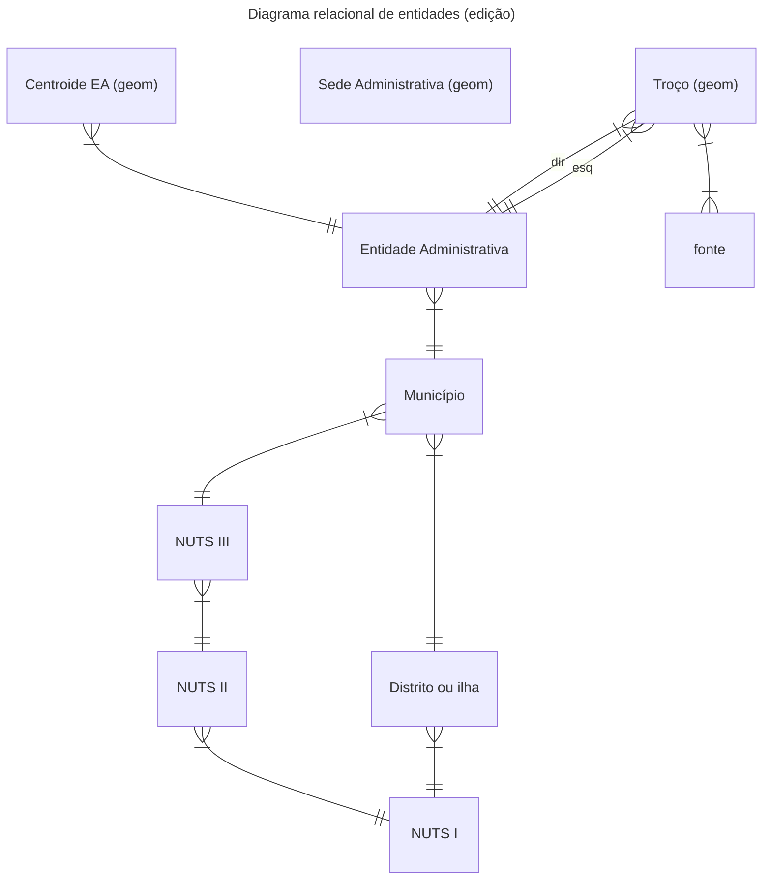

# Modelo de dados CAOP

## Introdução

Este trabalho propõe-se a criar um modelo de dados acsente numa base de dados relacional em PostgreSQL/PostGIS que permita a edição, gestão e histórico dos dados da Carta Administrativa Oficial de Portugal (CAOP).

Tivemos com objectivo manter, tanto quanto possível, a estrutura dos dados finais quando comparados com publicações anteriores. Por outro lado, procurou-se usar conceitos e técnicas já aplicadas a outras bases de dados nacionais, como é o caso da CartTop2 para a cartografia topográfica.

Finalmente, foi tida em conta a necessidade de transposição da CAOP para outros modelos de dados, nomeadamente a EuroBoundaries, e o tema Administrative Boundaries do INSPIRE.

## Modelo relacional conceptual

### Entidade `Entidade administrativa`

Os objecto desta entidade representam as unidades administrativas de nível 5, as freguesias ou uniões de freguesias. As entidades administrativas
(EA) são identificadas inequivocamente através de um código único (DICOFRE ou
DTMNFR). São ainda incluído o *Oceano Atlântico* e *Espanha*. Esta entidade estabelece uma relação de 1:n com a a unidade administrativa de nível superior a que pertence (município).
Esta entidade é alfanumérica, não tendo atributos geométricos.

### Entidade `Municipio`

Os objectos desta entidade representam a unidades administrativas de nível 4, os municípios. Os municípios são identificados inequivocamente através de um código único (DICO ou DTMN). Esta entidade estabelece uma relação de 1:n com a a unidade administrativa superior (distrito ou ilha) e uma relação 1:n com a unidade estatística (NUTS3) a que pertence.
Esta entidade é alfanumérica, não tendo atributos geométricos.

### Entidade `Distrito ou Ilha`

Os objectos desta entidade representam a unidades administrativas de nível 3, os distritos no continente e as ilhas das regiões autónomas. Os objectos são identificados inequivocamente através de um código único (DI ou DT). Esta entidade estabelece uma relação de 1:n com a unidade estatística (NUTS1) a que pertence.
Esta entidade é alfanumérica, não tendo atributos geométricos.

### Entidade `Troço`

Cada objecto desta entidade representa um troço (linha) de delimitação entre duas entidades
administrativas ou o limite de uma entidade administrativa com o oceano Atlantico ou a fronteira com Espanha.
Esta entidade estabelece uma relação de n:m para com as entidades administrativas, representando a entidade administrativa à esquerda e à direita da linha.
Esta entidade estabelece uma relação de n:m para com a entidade fonte.

### Entidade `Centroide EA`

Cada objecto desta entidade representa o centro (não necessariamente geométrico)
de uma área administrativa. Cada área administrativa, que assume posteriormente a
forma de um polígono pela conjugação de um centroide e dos troços que o rodeiam, representa uma área desconexa de uma entidade administrativa (freguesia ou união de freguesias).
Esta entidade estabelece uma relação de 1:n para com as entidades administrativas.

### Entidade `Fonte`

Os objectos desta tabela representam fontes (Decreto-Lei, Cadastro, etc...) que deram origem à delimitação dos troços.

### Entidade `NUTS III`

Os objectos desta entidade representam a Nomenclatura das Unidades Territoriais para Fins Estatísticos (NUTS - *Nomenclature of Territorial Units for Statistics*) de nível 3.

Esta entidade estabelece uma relação de 1:n com a entidade municípios e uma relação de n:1 com a entidade NUTS II a que pertence.

### Entidade `NUTS II`

Os objectos desta entidade representam a Nomenclatura das Unidades Territoriais para Fins Estatísticos (NUTS - *Nomenclature of Territorial Units for Statistics*) de nível 2.

Esta entidade estabelece uma relação de 1:n com a entidade municípios e uma relação de n:1 com a entidade NUTS II a que pertence.

### Entidade `NUTS I`

Os objectos desta entidade representam a Nomenclatura das Unidades Territoriais para Fins Estatísticos (NUTS - *Nomenclature of Territorial Units for Statistics*) de nível 1.

Esta entidade estabelece uma relação de 1:n com a entidade NUTS II e uma relação de 1:n com a entidade Distritos.

### Entidade `Sede Administrativa`

O objectos desta entidade representam a localização e nomenclatura das sedes administrativas aos vários níveis (e.g. Freguesia, Município, Distrito ou Ilha). Esta entidade não estabelece nenhuma relação formal com as restantes entidade, pois a relação é feita geometricamente já na faze de outputs.

