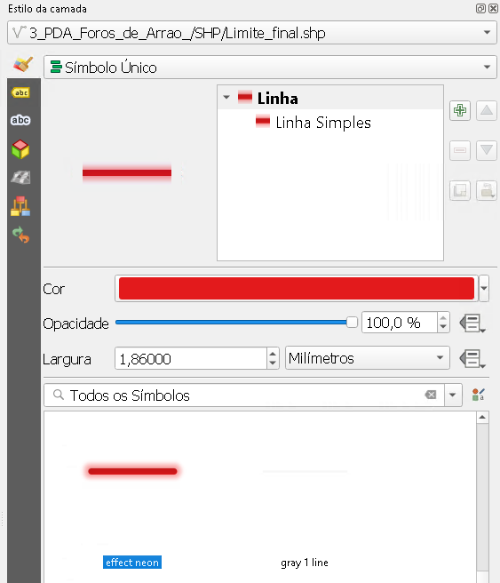

# Estudo e definição de um novo modelo conceptual para a CAOP adaptado ao PostgreSQL/PostGIS, adaptação ao modelo de dados INSPIRE e desenvolvimento de scripts

## Introdução

Este trabalho propõe-se a criar um modelo de dados acente numa base de dados relacional em PostgreSQL/PostGIS que permita a edição, gestão e histórico dos dados da Carta Administrativa Oficial de Portugal (CAOP).

Tivemos com objectivo manter, tanto quanto possível, a estrutura dos dados finais quando comparados com publicações anteriores. Por outro lado, procurou-se usar conceitos e técnicas já aplicadas a outras bases de dados nacionais, como é o caso da CartTop2 para a cartografia topográfica.

Finalmente, foi tida em conta a necessidade de transposição da CAOP para outros modelos de dados, nomeadamente a EuroBoundaries, e o tema Administrative Boundaries do INSPIRE.

## Modelo relacional conceptual


### Entidade `Entidade administrativa`

Os objecto desta entidade representam as unidades administrativas de nível 5, as freguesias ou uniões de freguesias. As entidades administrativas
(EA) são identificadas inequivocamente através de um código único (DICOFRE ou
DTMNFR). São ainda incluído o *Oceano Atlânctico* e *Espanha*. Esta entidade estabelece uma relação de 1:n com a a unidade administrativa de nível superior a que pertence (município).
Esta entidade é alfanumérica, não tendo atributos geométricos.

### Entidade `Municipio`

Os objectos desta entidade representam a unidades administrativas de nível 4, os municípios. Os municípios são identificados inequivocamente através de um código único (DICO ou DTMN). Esta entidade estabelece uma relação de 1:n com a a unidade administrativa superior (distrito ou ilha) e uma relação 1:n com a unidade estatística (NUTS3) a que pertence.
Esta entidade é alfanumérica, não tendo atributos geométricos.

### Entidade `Distrito ou Ilha`

Os objectos desta entidade representam a unidades administrativas de nível 3, os distritos no continente e as ilhas das regiões autónomas. Os objectos são identificados inequivocamente através de um código único (DI ou DT). Esta entidade estabelece uma relação de 1:n com a unidade estatística (NUTS1) a que pertence.
Esta entidade é alfanumérica, não tendo atributos geométricos.

### Entidade `Troço`

Cada objecto desta entidade representa um troço (linha) de delimitação entre duas entidades
administrativas ou o limite de uma entidade administrativa com o oceano Atlantico ou a fronteira com Espanha.
Esta entidade estabelece uma relação de n:m para com as entidades administrativas, representando a entidade administrativa à esquerda e à direita da linha.
Esta entidade estabelece uma relação de n:m para com a entidade fonte.

### Entidade `Centroide EA`

Cada objecto desta entidade representa o centro (não necessariamente geométrico)
de uma área administrativa. Cada área administrativa, que assume posteriormente a
forma de um polígono pela conjugação de um centroide e dos troços que o rodeiam, representa uma área desconexa de uma entidade administrativa (freguesia ou união de freguesias).
Esta entidade estabelece uma relação de 1:n para com as entidades administrativas.

### Entidade `Fonte`

Os objectos desta tabela representam fontes (Decreto-Lei, Cadastro, etc...) que deram origem à delimitação dos troços.

### Entidade `NUTS III`

Os objectos desta entidade representam a Nomenclatura das Unidades Territoriais para Fins Estatísticos (NUTS - *Nomenclature of Territorial Units for Statistics*) de nível 3.

Esta entidade estabelece uma relação de 1:n com a entidade municípios e uma relação de n:1 com a entidade NUTS II a que pertence.

### Entidade `ǸUTS II`

Os objectos desta entidade representam a Nomenclatura das Unidades Territoriais para Fins Estatísticos (NUTS - *Nomenclature of Territorial Units for Statistics*) de nível 2.

Esta entidade estabelece uma relação de 1:n com a entidade municípios e uma relação de n:1 com a entidade NUTS II a que pertence.


### Entidade `NUTS I`

Os objectos desta entidade representam a Nomenclatura das Unidades Territoriais para Fins Estatísticos (NUTS - *Nomenclature of Territorial Units for Statistics*) de nível 1.

Esta entidade estabelece uma relação de 1:n com a entidade NUTS II e uma relação de 1:n com a entidade Distritos.

### Entidade `Sede Administrativa`

O objectos desta entidade representam a localização e nomenclatura das sedes administrativas aos vários níveis (e.g. Freguesia, Munícipio, Distrito ou Ilha). Esta entidade não estabelece nenhuma relação formal com as restantes entidade, pois a relação é feita geometricamente já na faze de outputs.

## Implementação do modelo (schemas, dominios, tabelas e atributos)

Nesta secção descreve-se os principais schemas do modelo, as respectivas tabelas e atributos.

O modelo conceptual foi distribuído por dois schemas `dominios` e `base`.

### Schema `dominios`

No schema `dominios` são guardadas todas as tabelas referentes às listas de valores usados em alguns campos das tabelas do schema `base`.

**Nota**: As tabelas deste schema só são editaveis por utilizadores do grupo `administrador`

#### Tabela `dominios.caracteres_identificadores`

Descrição dos atributos da tabela:

| Coluna        | Tipo         | Restrições  |
|---------------|--------------|-------------|
| identificador | varchar(5)   | PRIMARY KEY |
| descricao     | varchar      | NOT NULL    |
| nome          | varchar(100) |             |

Valores possíveis:

| identificador | descricao                                                                         | nome             |
|---------------|-----------------------------------------------------------------------------------|------------------|
| PT            | Troço de limite que envolve apenas divisão administrativa em território português | Portugal         |
| PT#ES         | Troço de limite que pertence à fronteira internacional entre Portugal e Espanha   | Portugal#Espanha |

#### Tabela `dominios.estado_limite_administrativo`

Descrição dos atributos da tabela:

| Coluna        | Tipo         | Restrições  |
|---------------|--------------|-------------|
| identificador | varchar(3)   | PRIMARY KEY |
| descricao     | varchar      | NOT NULL    |
| nome          | varchar(100) |             |

Valores possíveis:

| identificador | Descrição                                                                                | Nome           |
|---------------|------------------------------------------------------------------------------------------|----------------|
| 1             | Troço de limite obtido a partir de procedimentos realizados para o efeito.               | Definido       |
| 2             | Troço de limite por definir entre as partes                                              | Por Acordar    |
| 3             | Troço de limite que não se encontra aceite pelas partes                                  | Não Acordado   |
| 4             | Troço de limite cuja aceitação pelas partes ainda não foi comunicada oficialmente        | Não Confirmado |
| 998           | Linha que define exclusivamente parte de um limite, e que se encontra localizado na água | Não Aplicável  |

#### Tabela `dominios.nivel_limite_administrativo`

Descrição dos atributos da tabela:

| Coluna        | Tipo         | Restrições  |
|---------------|--------------|-------------|
| identificador | varchar(3)   | PRIMARY KEY |
| descricao     | varchar      | NOT NULL    |
| nome          | varchar(100) |             |
| nome_en       | varchar(100) |             |

Valores possíveis:

| identificador | descricao                                            | nome          | nome_en        |
|---------------|------------------------------------------------------|---------------|----------------|
| 1             | Nível superior da hierarquia administrativa nacional | 1ª Ordem      | 1stOrder       |
| 2             | Segundo nível na hierarquia administrativa nacional  | 2ª Ordem      | 2ndOrder       |
| 3             | Terceiro nível na hierarquia administrativa nacional | 3ª Ordem      | 3rdOrder       |
| 4             | Quarto nível na hierarquia administrativa nacional   | 4ª Ordem      | 4thOrder       |
| 5             | Quinto nível na hierarquia administrativa nacional   | 5ª Ordem      | 5thOrder       |
| 6             | Sexto nível na hierarquia administrativa nacional    | 6ª Ordem      | 6thOrder       |
| 998           | Nível desconhecido ou indefinido                     | Não Aplicável | Non Applicable |

Esta tabela inclui a tradução do nome para inglês por ser útil para produção de *outputs* do EuroBoundaries e Inspire.

#### Tabela `dominios.significado_linha`

Descrição dos atributos da tabela:

| Coluna        | Tipo         | Restrições  |
|---------------|--------------|-------------|
| identificador | varchar(3)   | PRIMARY KEY |
| descricao     | varchar      | NOT NULL    |
| nome          | varchar(100) |             |

Valores:

| Identificador | Descrição                                                                 | Nome                    |
|---------------|---------------------------------------------------------------------------|-------------------------|
| 1             | Linha que define, simultaneamente, parte de um limite e de linha de costa | Limite e Linha de Costa |
| 2             | Linha que define exclusivamente a linha de costa                          | Linha de Costa          |
| 7             | Linha que define um limite que se localiza em terra                       | Limite em Terra         |
| 9             | Linha que define um limite que se localiza apenas em massa de água        | Limite na Água          |

#### Tabela `dominios.tipo_area_administrativa`

Descrição dos atributos da tabela:

| Coluna        | Tipo         | Restrições  |
|---------------|--------------|-------------|
| identificador | varchar(3)   | PRIMARY KEY |
| descricao     | varchar      | NOT NULL    |
| nome          | varchar(100) | NOT NULL    |
| ebm_name      | varchar(100) |             |

Valores:

| Identificador | Descrição                                                                                              | Nome                       |
|---------------|--------------------------------------------------------------------------------------------------------|----------------------------|
| 1             | Área principal da entidade administrativa, e que coincidirá com a localização da sede de freguesia     | Área Principal             |
| 3             | Área geometricamente separada de uma área principal                                                    | Área Secundária            |
| 4             | Área que tem uma competência específica                                                                | Área Especial              |
| 5             | Área, que engloba uma massa de água, e que se encontra fora de terra                                   | Área Costeira              |
| 7             | Área que se encontra longe de limites de costa, mas que engloba uma massa de água de grandes dimensões | Área de “Águas Interiores” |

#### Tabela `dominios.tipo_fonte`

Descrição dos atributos da tabela:

| Coluna        | Tipo         | Restrições  |
|---------------|--------------|-------------|
| identificador | varchar(3)   | PRIMARY KEY |
| descricao     | varchar      | NOT NULL    |
| nome          | varchar(100) |             |

Valores:

| Identificador | Descrição                                                                                                                                                                                                                                                                                                 | Nome                                                                              |
|---------------|-----------------------------------------------------------------------------------------------------------------------------------------------------------------------------------------------------------------------------------------------------------------------------------------------------------|-----------------------------------------------------------------------------------|
| 1             | Norma jurídica redigida por entidade oficial competente publicada e posteriormente impressa na publicação oficial portuguesa                                                                                                                                                                              | Lei                                                                               |
| 2             | Ferramenta legislativa usada pelo poder executivo para legislar sobre matéria na qual é competente, sendo obrigatoriamente posterior alvo de publicação no jornal oficial português                                                                                                                       | Decreto-Lei                                                                       |
| 3             | Ordem publicada no jornal oficial português, que foi emanada por autoridade superior ou órgão que determina o cumprimento de uma resolução                                                                                                                                                                | Decreto                                                                           |
| 4             | Documento administrativo de qualquer autoridade pública, publicado no jornal oficial português, que contém instruções acerca da aplicação de leis ou regulamentos, recomendações de carácter geral, normas de execução, nomeações, demissões, punições, ou qualquer outra determinação da sua competência | Portaria                                                                          |
| 5             | Documento administrativo de qualquer autoridade pública, publicado no jornal oficial português, que contém a indicação de alterações, em número reduzido, ao teor de uma lei, decreto-lei, decreto ou outro texto oficial outrora publicado, e na qual se encontram omissões ou incorreções               | Retificação                                                                       |
| 6             | Ato de um juiz de um tribunal administrativo português que extingue o processo decidindo determinada questão posta em juízo, decidindo sobre o ato administrativo, resolvendo o conflito de interesses que suscitou a abertura do processo entre as entidades públicas                                    | Acção Administrativa Comum                                                        |
| 7             | Ato de um juiz de um tribunal administrativo português que extingue o processo decidindo determinada questão posta em juízo, resolvendo o conflito de interesses que suscitou a abertura do processo entre as partes                                                                                      | Sentença de Tribunal Administrativo                                               |
| 8             | Conjunto de trabalhos técnicos conducentes ao estabelecimento de um determinado limite administrativo                                                                                                                                                                                                     | Procedimento Delimitação Administrativa                                           |
| 9             | Dados cartográficos, que foram capturados, manipulados e disponibilizados pelo Instituto Geográfico do Exército, de acordo com as competências legalmente incumbidas a esta instituição                                                                                                                   | Dados Instituto Geográfico do Exército                                            |
| 10            | Dados cartográficos que foram capturados e manipulados pela Direção-Geral do Território, ou por instituição antecedente, com o intuito de caracterizar administrativamente os prédios de acordo com as especificações técnicas definidas para o cadastro geométrico da propriedade rústica                | Cadastro Geométrico da Propriedade Rústica                                        |
| 11            | Dados cartográficos recolhidos, manipulados e disponibilizados, com finalidade estatística, de acordo com as especificações técnicas estabelecidos para o momento censitário Censos 2001, da responsabilidade do Instituto Nacional de Estatística                                                        | Censos 2001                                                                       |
| 12            | Documento administrativo de qualquer autoridade pública, publicado no jornal oficial português, onde constam dados relacionados com outro diploma legal                                                                                                                                                   | Declaração                                                                        |
| 13            | Ferramenta legislativa usada pelo poder executivo para legislar sobre matéria na qual é competente, no domínio da autonomia regional, sendo obrigatoriamente posterior alvo de publicação no jornal oficial português                                                                                     | Decreto Legislativo Regional                                                      |
| 14            | Dados cartográficos que foram capturados, manipulados e disponibilizados pela Região Autónoma da Madeira, de acordo com as competências legalmente incumbidas a esta instituição                                                                                                                          | Dados da Direção Regional do Ordenamento do Território e Ambiente (R. A. Madeira) |
| 15            | Documento administrativo enviado por uma autarquia, enviado à Direção-Geral do Território, que contém a indicação de alterações a um ou mais troços de limites administrativos da entidade administrativa envolvida                                                                                       | Ofício                                                                            |
| 16            | Dados cartográficos que foram capturados, manipulados e disponibilizados pela Região Autónoma da Madeira, de acordo com as competências legalmente incumbidas a esta instituição                                                                                                                          | Dados da Direção Regional do Ordenamento do Território (R. A. Madeira)            |
| 17            | Dados cartográficos, que foram capturados, manipulados e disponibilizados pelo Instituto                                                                                                                                                                                                                  |                                                                                   |

#### Tabela `dominios.tipo_sede_administrativa`

Esta tabela foi criada com base na tabela `DesignacaoLocal` do modelo de dados **CartTop** para facilitar a importação de dados da mesma para a CAOP.

Descrição dos atributos da tabela:

| Coluna        | Tipo         | Restrições  |
|---------------|--------------|-------------|
| identificador | varchar(1)   | PRIMARY KEY |
| descricao     | varchar      | NOT NULL    |
| nome          | varchar(100) | NOT NULL    |

Valores:

| Identificador | Descrição                              | Nome                                                                       |
|---------------|----------------------------------------|----------------------------------------------------------------------------|
| 1             | Capital do País                        | Cidade onde está situada a sede administrativa do país.                    |
| 2             | Sede administrativa de Região Autónoma | Cidade onde está situada a sede administrativa da Região Autónoma.         |
| 3             | Capital de Distrito                    | Cidade onde está situada a sede administrativa do distrito.                |
| 4             | Sede de Concelho                       | Lugar onde está instalada a Câmara Municipal e que dá o nome ao município. |
| 5             | Sede de Freguesia                      | Lugar onde está instalada a freguesia e que dá o nome à mesma.             |

### Schema `base`

No schema `base` são guardadas todas as tabelas editáveis que permitem a edição e gestão da CAOP. Estas são as tabelas de trabalho para os editores da CAOP.

Por questões de gestão dos diferentes sistemas de coordenadas, optou-se por separar algumas entidades em diferentes tabelas espaciais (com colunas de geometria), nomeadamente `centroide_ea` e `troco` pelas quatro regiões com prefixos e códigos EPSG distintos:

* `_cont` - Continente (EPGS: 3763)
* `_ram` - Região Autónoma da Madeira (EPSG: 5016)
* `_raa_oci` - Região Autónoma dos Açores, Grupo Ocidental (EPSG: 5014)
* `_raa_cen_ori` - Região Autónoma dos Açores, Grupo Central e Oriental (EPSG: 5015)

Dada a relação de muitos para muitos (n:m) entre os troços e as fontes também as tabelas auxiliares tiveram de ser separadas por regiões (`lig_cont_troco_fonte`, `lig_ram_troco_fonte`, `lig_raa_oci_troco_fonte`, `lig_raa_cen_ori_troco_fonte`)

**Nota:** Na documentação, por uma questão de simplicidade e por se tratar de informação redundante, estas tabelas com prefixos são descritas apenas uma vez.

A tabela `sede_administrativa`, geométrica do tipo ponto, visto ser apenas usada para gerar outputs do euroBoundaries e INSPIRE, e não requerendo uma precisão posicional elevada, optou-se por manter apenas uma única tabela no sistema global EPSG:4258.

As restantes tabelas são não espaciais, sem prefixos e são consideradas globais.

Na descrição abaixo apenas se descreve as tabelas identicas um vez, sendo a estrutura idêntica globalmente

#### Tabelas `base.troco`

A implementação da entidade `Troço` é feita pelas seguintes tabelas:

* `base.troco_cont`
* `base.troco_ram`
* `base.troco_raa_oci`
* `base.troco_raa_cen_ori`

Cada registo destas tabelas representa um troço de delimitação entre duas entidades
administrativas ou o limite de uma entidade administrativa com o oceano Atlantico ou Espanha.

Em termos geométricos, os troços são representados por linhas simples. Em termos topológicos, entre dois troços, não são permitidas sobreposição dos interiores das geometrias. Ou seja, apenas os inícios e fins das *linestrings* (*boundary* da geometria) podem tocar outros troços. Também é considerado erro topológico quando o inicio ou fim
de um troço não se conecta a pelo menos um outro troço. Exceção feita a troços fechados.

##### Descrição dos atributos

| Nome da Coluna      | Tipo de Dados        | Not Null | Referência (Coluna)                                      | Restrições  |
|---------------------|----------------------|----------|----------------------------------------------------------|-------------|
| identificador       | uuid                 | Sim      |                                                          | PRIMARY KEY |
| ea_direita          | varchar(8)           | Não      | base.entidade_administrativa (codigo)                    |             |
| ea_esquerda         | varchar(8)           | Não      | base.entidade_administrativa (codigo)                    |             |
| pais                | varchar(5)           | Não      | dominios.caracteres_identificadores_pais (identificador) |             |
| estado_limite_admin | varchar(3)           | Não      | dominios.estado_limite_administrativo (identificador)    |             |
| significado_linha   | varchar(3)           | Não      | dominios.significado_linha (identificador)               |             |
| nivel_limite_admin  | varchar(3)           | Não      | dominios.nivel_limite_administrativo (identificador)     |             |
| troco_parente       | uuid                 | Não      |                                                          |             |
| geometria           | geometry(linestring) | Não      |                                                          |             |

##### Diagram relacional


#### `base.centroide_ea`

A entidade `Centroide EA` é implementada nas seguintes tabelas:

* `base.centroide_ea_cont`
* `base.centroide_ea_ram`
* `base.centroide_ea_raa_oci`
* `base.centroide_ea_raa_cen_ori`

Cada registo nestas tabelas representa o centro (não obrigatoriamente geométrico)
de uma área administrativa. Cada área administrativa, que assume posteriormente a
forma de um polígono, representa uma área desconexa de uma entidade administrativa (freguesia ou união de freguesias).

Em termos topológico, dentro de cada área administrativa deve existir apenas um
centroide. A inexistencia de centroide, ou a sua multiplicidade é considerado um erro. Impedindo a correcta criação dos polígonos CAOP.

##### Descrição dos atributos

| Nome da Coluna              | Tipo de Dados                | Not Null | Referência (Coluna)                               | Restrições  |
|-----------------------------|------------------------------|----------|---------------------------------------------------|-------------|
| identificador               | uuid                         | Sim      |                                                   | PRIMARY KEY |
| entidade_administrativa     | varchar(8)                   | Não      | base.entidade_administrativa (codigo)             |             |
| tipo_area_administrativa_id | varchar(3)                   | Não      | dominios.tipo_area_administrativa (identificador) |             |
| geometria                   | public.geometry(point, 3763) | Sim      |                                                   |             |

##### Diagram relacional


#### `base.entidade_administrativa`

Implementação da entidade Entidade administrativa. Os registos desta tabela alfanumérica representam as unidades administrativas de nível 5, o mais baixo (freguesias ou uniões de freguesias). As entidades administrativas (EA) são identificadas
inequivocamente através de um código único (DICOFRE ou DTMNFR). São ainda
incluídas as entidades *Oceano Atlânctico* e *Espanha*. Para além do nome da entidade administrativa, é também identificada a unidade administrativa de nível superior a que pertence (município).

Uma restrição garante que o código único da entidade administrativa é compatível com o código do município identificado.

##### Descrição dos atributos

| Nome da Coluna | Tipo de Dados | Not Null | Referência (Coluna)     | Restrições                               |
|----------------|---------------|----------|-------------------------|------------------------------------------|
| identificador  | uuid          | Sim      |                         | PRIMARY KEY                              |
| codigo         | varchar(8)    | Sim      |                         | UNIQUE (entidade_administrativa_cod_key) |
| nome           | varchar       | Sim      |                         |                                          |
| municipio_cod  | varchar(4)    | Não      | base.municipio (codigo) | CHECK dtmnfr_dtmn_compativeis            |

#### `base.municipio`

Implementação da entidade Municipio. Os registos desta tabela alfanumérica representam a unidades administrativas de nível 4, os municípios. Os municípios são identificados
inequivocamente através de um código único (DICO ou DTMN). Para além do nome da entidade administrativa, é também identificada a unidade administrativa superior (distrito ou ilha) e a unidade estatística (NUTS3) a que pertence.

##### Descrição dos atributos

| Nome da Coluna | Tipo de Dados | Not Null | Referência (Coluna)     | Restrições |
|----------------|--------------|----------|-----------------------------|-----------------------------|
| identificador  | UUID         | Yes      |                             | PRIMARY KEY                 |
| codigo         | VARCHAR(4)   | Yes      |                             | UNIQUE (municipio_dico_key) |
| nome           | VARCHAR      | Yes      |                             |                             |
| distrito_cod   | VARCHAR(2)   | Yes      | base.distrito_ilha (codigo) | CHECK dtmn_dt_compativeis                            |
| nuts3_cod      | VARCHAR(5)   | Yes      | base.nuts3 (codigo)         |                             |

Uma restrição garante que o código único do município é compatível com o código do distrito ou ilha identificado.

#### distrito_ilha

Implementação da entidade Município

Os registos desta tabela alfanumérica representam a unidades administrativas de nível 3, os distritos e ilhas das regiões autónomas. Os distritos são identificados
inequivocamente através de um código único (DI ou DT). Para além do nome da entidade administrativa, salienta-se a identificação da unidade estatística (NUTS1) a que pertence.

##### Descrição dos atributos

| Nome da Coluna     | Tipo de Dados         | Not Null | Referência (Coluna)       | Restrições                              |
|--------------------|-----------------------|----------|---------------------------|----------------------------------------|
| identificador      | uuid                  | Sim      |                           | PRIMARY KEY                            |
| codigo             | varchar(2)            | Sim      |                           | UNIQUE (distrito_ilha_di_key)          |
| nome               | varchar               | Sim      |                           |                                        |
| nuts1_cod          | varchar(3)            | Sim      | base.nuts1 (codigo)       |                                        |

#### `base.fonte`

Os registos desta tabela alfanumérica representam fontes (Decreto-Lei, Cadastro, etc...) na origem da delimitação dos troços existentes na tabela `base.troco`.

##### Descrição dos atributos (base.fonte)

| Nome da Coluna     | Tipo de Dados         | Not Null | Referência (Coluna)       | Restrições                              |
|--------------------|-----------------------|----------|---------------------------|----------------------------------------|
| identificador      | uuid                  | Sim      |                           | PRIMARY KEY                            |
| tipo_fonte         | varchar(3)            | Não      | dominios.tipo_fonte (identificador) |                                   |
| descricao          | varchar(255)          | Não      |                           |                                        |
| data               | date                  | Não      |                           | DEFAULT now()                          |
| observacoes        | varchar               | Não      |                           |                                        |
| diploma            | varchar(255)          | Não      |                           |                                        |

A entidade `fonte` estabelece uma relação de N:M com a entidade `troco`, onde um troço pode ter origem em várias fontes e a mesma fonte pode estar na origem de diferentes troços. Esta relação é implementa através das seguintes tabelas auxiliares:

* `base.lig_troco_cont_fonte`
* `base.lig_troco_ram_fonte`
* `base.lig_troco_raa_oci_fonte`
* `base.lig_troco_raa_cen_ori_fonte`

##### Descrição dos atributos (`lig_troco_fonte``)

| Nome da Coluna     | Tipo de Dados         | Not Null | Referência (Coluna)              | Restrições                              |
|--------------------|-----------------------|----------|----------------------------------|----------------------------------------|
| identificador      | uuid                  | Sim      |                                  | PRIMARY KEY                            |
| troco_id           | uuid                  | Não      | base.cont_troco (identificador)  | ON DELETE CASCADE                      |
| fonte_id           | uuid                  | Não      | base.fonte (identificador)       |                                        |

##### Diagrama relacional ligação N:M (Exemplo Continente)


#### nuts1

Os registos desta tabela alfanumérica representam a Nomenclatura das Unidades Territoriais para Fins Estatísticos (NUTS - *Nomenclature of Territorial Units for Statistics*) de nível 1.

##### Descrição dos atributos

| Nome da Coluna     | Tipo de Dados         | Not Null | Referência (Coluna) | Restrições                    |
|--------------------|-----------------------|----------|---------------------|------------------------------|
| identificador      | uuid                  | Sim      |                     | PRIMARY KEY                  |
| codigo             | varchar(3)            | Sim      |                     | UNIQUE (codigo)              |
| nome               | varchar               | Sim      |                     | UNIQUE (nome)                |

#### nuts2

Os registos desta tabela alfanumérica representam a Nomenclatura das Unidades Territoriais para Fins Estatísticos (NUTS - *Nomenclature of Territorial Units for Statistics*) de nível 2.

Para além do código e nome da NUTS, salienta-se a indicação da NUTS de nivel superior a que pertence (NUTS I), estabelecendo uma relação com a respectiva tabela.

##### Descrição dos atributos

| Nome da Coluna     | Tipo de Dados         | Not Null | Referência (Coluna)     | Restrições                    |
|--------------------|-----------------------|----------|-------------------------|------------------------------|
| identificador      | uuid                  | Sim      |                         | PRIMARY KEY                  |
| codigo             | varchar(4)            | Sim      |                         | UNIQUE (codigo)              |
| nome               | varchar               | Sim      |                         | UNIQUE (nome)                |
| nuts1_cod          | varchar(3)            | Sim      | base.nuts1 (codigo)     | FOREIGN KEY ON UPDATE CASCADE|

#### nuts3

Os registos desta tabela alfanumérica representam a Nomenclatura das Unidades Territoriais para Fins Estatísticos (NUTS - *Nomenclature of Territorial Units for Statistics*) de nível 3.

Para além do código e nome da NUTS, salienta-se a indicação da NUTS de nivel superior a que pertence (NUTS II), estabelecendo uma relação com a respectiva tabela.

##### Descrição dos atributos

| Nome da Coluna     | Tipo de Dados         | Not Null | Referência (Coluna)     | Restrições                    |
|--------------------|-----------------------|----------|-------------------------|------------------------------|
| identificador      | uuid                  | Sim      |                         | PRIMARY KEY                  |
| codigo             | varchar(5)            | Sim      |                         | UNIQUE (codigo)              |
| nome               | varchar               | Sim      |                         | UNIQUE (nome)                |
| nuts2_cod          | varchar(4)            | Sim      | base.nuts2 (codigo)     | FOREIGN KEY ON UPDATE CASCADE|


#### `base.sede_administrativa`

Os registos desta tabela geométrica representam as sede administrativas aos vários níveis (e.g. Freguesia, Munícipio, Distrito ou Ilha). A gestão destes dados prende-se essencialmente com a necessidade desta informação para os outputs da EuroBoundaries, não tendo equivalência nos outputs CAOP.

Actualmente este conjunto de dados apenas contém sedes até ao nível do município. Prevê-se que de futuro os dados possam vir a ser complementados com informação vinda da Base Nacional de Cartografia Topográfica.

O campo `ebm_roa` é preenchido com códigos gerados pelo Euroboundaries, pelo que qualquer actualização desta tabela, nomeadamente adição das sedes de Freguesia, deve ser feita em coordenação com a EuroBoundaries.

| Nome da Coluna          | Tipo de Dados         | Not Null | Referência (Coluna)               | Restrições                        |
|-------------------------|-----------------------|----------|----------------------------------|----------------------------------|
| identificador           | uuid                  | Sim      |                                  | PRIMARY KEY                      |
| tipo_sede_administrativa    | varchar(1)            | Sim      | dominios.tipo_sede_administrativa (identificador) | FOREIGN KEY                      |
| nome                    | varchar(255)          | Sim      |                                  |                                  |
| ebm_roa                 | varchar(100)          | Não      |                                  |                                  |
| geometria               | public.geometry(point, 4258) | Sim  |                                  |                                  |

## Registo de histórico

Foi criado um sistema de histórico, aplicado a todas as tabelas dos schemas `base` e `dominios`.

A todas as tabelas desses dois schemas são adicionados os seguintes campos

* `inicio_objeto`
* `utilizador`
* `motivo`

Durante a edição nas tabelas, os campos `inicio_objeto` e `utilizador` são preenchidos automaticamente.

O campo `motivo` tem por objectivo dar algum contexto às alterações executadas, ajudando a leitura do histórico. Este campo só é preenchido de forma semiautomática se forem usados os projectos oficiais de edição no QGIS em simultâneo com o Plugin CAOP Tools (ver descrição dos procedimentos de edição).

Para cada tabela sob histórico, existe uma camada de backup no schema `versionamento` onde são gravadas todas as linhas alteradas ou apagadas, com as respectiva data de alteração ou eliminação.

Recorrendo a SQL, existe uma função **vsr_table_at_time(nome da tabela, data e hora)** que permite visualizar uma tabela em determinada data:

```SQL
SELECT * from vsr_table_at_time (NULL::"base".cont_troco, '2014-04-19 18:26:57');
```

### Descrição dos dados gerados

A implementação do modelo conceptual, permite-nos gerar vários conjuntos de dados:

#### CAOP

A criação de outputs CAOP é feita por região, sendo que para cada uma das regiões cria as seguintes tabelas (identificadas pelo respectivo prefixo):

* {regiao}_trocos
* {regiao}_areas_administrativas
* {regiao}_freguesias
* {regiao}_municipios
* {regiao}_distritos
* {regiao}_nuts3
* {regiao}_nuts2
* {regiao}_nuts1
* inf_fonte_troco

Os outputs CAOP podem ser criados quer através de funções disponíveis na base de
dados.

* **gerar_poligonos_caop(output_schema , prefixo , data_hora\versao )**

  Função para gerar os poligonos de output da CAOP com base nos trocos e centroides existentes no schema base
  **ATENÇÃO: NECESSITA DE PERMISSÕES DE ADMINISTRADOR PARA CORRER POIS CRIA SCHEMAS e DÁ PERMISSÕES.**

  **parametros:**

  - **output_schema** (TEXT) - nome do schema onde guardar os resultados, default 'master'
  - **prefixo** (TEXT) - prefixo que permite separar entre o continente e as ilhas, valores possiveis são ('cont', 'ram','raa_oci','raa_cen_ori'), default 'cont'
  - **data_hora** (TIMESTAMP) , permite definir um dia e hora para criar um output baseado em dados passados, default hora actual
  - **versao** (TEXT), como alternativa à data_hora, é possível usar uma versão, registada
    na tabela `versioning.versao`

* **actualizar_trocos(prefixo )**

   Função para preencher campos `ea_direita`, `ea_esquerda` e o `nivel_limite_admin` com base nos polígonos gerados pela função gerar_poligonos_caop para o schema master.

   Parametros:

   - **prefixo** (TEXT) - prefixo que permite separar entre o continente e as     ilhas, valores possiveis são ('cont', 'ram','raa_oci','raa_cen_ori'), default 'cont'

* **actualizar_poligonos_caop(output_schema, prefixo, data_hora)**

  Função para actualizar os poligonos de output da CAOP com base no schema e em vistas materializadas já existentes.
  Para correr em schemas de output inexistentes, há que correr primeiro a funcao gerar_poligonos_caop. NECESSITA DE PERMISSÕES DE EDITOR PARA CORRER POIS CRIA SCHEMAS e DÁ PERMISSÕES.

  **Parametros**:

  - **output_schema** (TEXT) - nome do schema onde guardar os resultados, default 'master'
  - **prefixo** (TEXT) - prefixo que permite separar entre o continente e as ilhas, valores possiveis são ('cont', 'ram','raa_oci','raa_cen_ori'), default 'cont'
  - **data_hora** (TIMESTAMP) , permite definir um dia e hora para criar um output baseado em dados passados, default hora actual


* **gerar_trocos_caop(output_schema , prefixo, data_hora )**

  Função para exportar os trocos de output da CAOP com base nos trocos no schema base.

  parametros:
  - **output_schema** (TEXT) - nome do schema onde guardar os resultados, default 'master'
  - **prefixo** (TEXT) - prefixo que permite separar entre o continente e as ilhas, valores possiveis são ('cont', 'ram','raa_oci','raa_cen_ori'), default 'cont'
  - **data_hora** (TIMESTAMP) , permite definir um dia e hora para criar um output baseado em dados passados, default hora actual
  - **versao** (TEXT), como alternativa à data_hora, é possível usar uma versão, registada na tabela `versioning.versao`

Para facilitar a criação de outputs CAOP, foi criado um interface gráfico em ambiente QGIS para correr estas funções de forma encadeada consoante o objectivo.

### EuroBoundaries

A criação de outputs EuroBoundaries é feita de forma global, usando os dados actualizados com schema master. As tabelas geradas são as seguintes:

* ebm_a
* ebm_nuts
* ebm_nam

A geração dos outputs EuroBoundaries é feita através de um script SQL `03a_criar_outputs_euroboundaries.sql`

### Inspire

A criação de outputs Inspire é feita por região, sendo que para cada uma das regiões  cria as seguintes tabelas (identificadas pelo respectivo sufixo):

* inspire_admin_boundaries_{regiao}
* inspire_admin_units_5thorder_{regiao}
* inspire_admin_units_4thorder_{suffixo}
* inspire_admin_units_3rdhorder_{suffixo}

A geração dos outputs EuroBoundaries é feita através de um script SQL `03b_criar_outputs_inspire.sql`


### Schema master

Schema criado e mantido pela ferramenta Actualizar CAOP

### Schema temp

Schema composto por dados temporários, usados na geração dos outputs, e de arquivo,usados durante a importação inicial dos dados.

### Schema EuroBoundaries

* Lista de schemas e tabelas editaveis

## Utilizadores e permissões

* **administrador** - utilizador com permissões elevadas, permitindo-lhe alterar a estrutura das tabelas, alterar os domínios, alterar os projectos QGIS, adicionar novos roles e adicioná-los aos grupos de utilizadores
* **editor** - grupo de utilizadores com permissões para edição dos dados das tabelas editaveis (centroides, trocos, etc...) e de leitura dos projectos QGIS
* **leitor** - grupo apenas com permissões de leitura quer de tabelas, quer de projectos QGIS


## Funções para geração de outputs

# Visualização e edição dos dados em QGIS

Para tornar a visualização e edição dos dados da CAOP de forma adequada e conveniente,
foram criados projectos QGIS para cada umas das regiões com EPSGs diferentes:

  * `projecto_caop_edicao_cont`
  * `projecto_caop_edicao_ram`
  * `projecto_caop_edicao_raa_oci`
  * `projecto_caop_edicao_raa_cen_ori`

Os projectos estão guardados directamente na base de dados. Por uma questão de preservação dos projectos, estes são *read-only* para os editores. Para efectuar alterações aos projectos é necessário usar o utilizador `administrador`.

## Configuração da ligação à base de dados

Tanto os dados, como os projectos de edição preparados são guardados na base de dados PostgreSQL/PostGIS. Por essa razão, para aceder aos mesmos através do QGIS, a primeira operação será estabelecer uma ligação à base de dados.

1. Abrir o QGIS
2. Se não estiver visível, activar o painel **Navegador** no menu **Configurações** > **Paineis** > **Navegador**
3. No painel **Navegador**, clicar com o botão direito do rato sobre o item **PostgreSQL** e escolher a opção **Nova ligação**
4. Na janela **Criar nova ligação PostGIS**, preencher os seguintes campos:

   * **Nome:** `CAOP Produção` ou `CAOP Testes`
   * **Máquina:** `192.168.10.102`
   * **Porta:** `5432`
   * **Base de dados:** `caop` ou `caop_testes`

5. Ainda na janela **Criar nova ligação PostGIS**, na secção **Autenticação**, escolher o separador **Configurações** e clicar no botão **Criar nova configuração de autenticação**.
6. Se exigido, escolha uma palavra-passe mestra. Esta será a única palavra-passe que terá de decorar quando precisar de aceder a projectos com necessidade de autenticação.

   

7. Na janela **Autenticação**, junto ao **Id** clicar no símbolo do cadeado e
   preencher o campo com `dgtprod`
8. Ainda na janela **Autenticação**, escolher\preencher os seguintes campos:
   * **Nome:** `Nome à escolha` (e.g. Credenciais CAOP)
   * `Basic authentication`
   * **Utilizador:** `Nome do utilizador PostgreSQL` (e.g. `user1`)
   * **Palavra-passe:** `Password do utilizador` (e.g. `pass1`)
9. Clicar em `Save`

   

10. De volta à janela **Criar nova ligação PostGIS**, clicar em **Testar ligação** para garantir que todos os dados de acesso estão correctos.
11. Garantir que pelo menos a opção **Permitir guardar e carregar projetos QGIS na base de dados** e clicar em **OK**

    

Agora no painel **Navegador** deverá ser possível visualizar a recém-criada ligação, clicando na mesma será possível visualizar o seu conteúdo.


## Instalação plugin CAOP Tools

Para auxiliar no processo de edição da CAOP e na geração de outputs, foi criado um plugin com as seguintes funcionalidades:

* Pré-preenchimento do campo `motivo` nos campos editados
* Actualização dos dados actuais no schema master
* Criar nova versão da CAOP
* Ferramenta de corte de troços com funcionalidades extras

A instalação do plugin é feita através do arquivo Zip fornecido.

1. Abrir o gestor de plugins em **Plugins** > **Gerir e instalar plugins...**
2. Escolher o separador **Instalar de um ZIP**
3. Clicar no campo **ZIP file** clicar no botão **...** (Navegar) e indique o caminho até ao ficheiro `caop_tools_x.x.x.zip` fornecido.
4. Clicar em **Instalar módulo**.
5. Fechar a janela dos **Plugins**

   

## Edição dos dados CAOP

### Abrir projecto de Edição

A edição dos dados CAOP é feita através de quatro projectos de edição preparados para QGIS, um por cada região para que se trabalhe sempre no sistema de coordenadas correcto.

Os projectos de edição estão guardados na base de dados, dentro do schema `public`. Para abrir um projecto seguimos os seguinte passos:

1. Aceder ao painel **Navegador**
2. Expandir a ligação à base de dados criada de antemão
3. Expandir o schema `public`.
4. Fazer duplo-clique sobre o nome do projecto (e.g. `projecto_caop_edicao_cont`) ou simplesmente arrastando-o para a área do mapa.

   

Os projectos de edição estão organizados da seguinte forma:

* **validação** - camadas de apoio à validação topológica dos dados.
* **base - editável** - camadas que habittualmente sofrem alterações no processos de actualização da CAOP
* **base - estável** - Camadas pertencentes ao modelo de dados CAOP, mas cuja edição é mais rara.
* **master outputs** - Camadas geradas pelos scripts de outputs para o estado actual da base de dados CAOP
* **dominios** - tabelas auxiliares com listas de valores
* **versioning** - tabelas relacionadas com o sistema de histórico
* **basemaps** - camadas auxiliares de contexto


### Ligar Snapping

Sempre que se esteja a editar as tabelas geométicas da CAOP (em particular os troços) é importante garantir que a função de **snapping** está ligada. O snapping ajuda a garantir a coerencia topológica entre os vários troços. Em QGIS,para ligar o snapping, seguimos os seguintes passos:

1. Se não estiver visível, ligar a barra de ferramentas **Snapping** em **Configurações** > **Barras de Ferramentas** > **Barra de Snapping**
2. Na barra de snapping, abilitar o snapping carregando no icon do iman.

3. Em termos de opções, no segundo botão da esquerda sugere-se o uso da **Camada activa** para apenas fazer snapping com elementos da camada `troco`. Caso se pretenda usar outras camadas como referência, sugere-se usar a opção **Configuração Avançada** e no botão **Editar Configuração Avançada** seleccionar apenas as camadas relevantes.
4. No terceiro botão da esquerda, deve~se usar só os **Vértice**
   

### Preencher o motivo

Na barra de Ferramentas **CAOP Tools** existe um campo de texto, onde se deve preencher o motivo da actual edição. Este texto é guardado automaticamente nos registos das tabelas, ajudando a ententer o histórico de cada registo.


### Operações de edição

#### Alteração de um troço

Uma das edições mais comuns é a alteração de uma fronteira entre duas Freguesias. É preciso isolar a secção do troço a alterar do restante troço que não será alterado. Para isso, usaremos a ferramentas de **Split Features** Específica do plugin CAOP Tools. A ferramenta tem três características que a distingue da ferramenta nativa do QGIS:

*  Sempre que um troço é cortado, são sempre criados novos identificadores para os troços resultantes.
*  O campo **troco_parente** é preenchido com o identificador do troço original, permitindo-nos manter uma ligação ao histórico dos novos troços.
*  As fontes associadas ao troço são replicadas a todos os novos troços.

Processo passo a passo:

1. Na toolbar `CAOP tools`, editar o campo **Motivo** com a descrição das alterações se vão fazer (e.g. `Alteração de fronteira entre a freguesia de Alcabideche e São Domingos de Rana`)
2. Seleccionar a camada `Fontes` e , se necessário, ligar a edição da mesma.
3. Na **Digitizing toolbar**, clique no botão **adicionar novo elemento**.
4. Preencha o formulário a informação relativa à nova fonte. Clique em Ok e grave as alterações na camada `Fontes`.
5. Seleccionar a camada `Troços` e , se necessário, ligar a edição da mesma.
6. Com uma ferramenta de seleção, selecionar o troço a cortar (este passo não é obrigatório, mas pode ajudar a evitar cortes por engano de outros troços)
7. Na toolbar `CAOP tools`, activar a ferramenta de corte do CAOP Tools

   

8. Usando a ferramenta de corte por cima do mapa, desenhar (clicando com o botão esquerdo do rato) uma linha que atravesse o troço no local (ou locais) onde se pretende cortá-lo para isolar os segmentos do troço que irão ser alterados. Para terminar a linha clicar com o botão direito do rato. (Se possível, devemos cortar as linhas em vertices já existentes).

   **Nota** Este passo pode ser feito através de vários cortes isolados.
9.  Usar as ferramentas do QGIS para alterar a geometria do novo troço (e.g. Editor de vértices (digitizing toolbar), reshape (Advanced digitizing toolbar), etc...)
10. Gravar as alterações na camada dos troços.
11. Usando a tabela de atributo ou a ferramenta identify, abrir o formulário do troço alterado. No separador **Fontes** ligar a edição, eliminar as fontes antigas e adicionar a nova fonte que foi criada no passo 3 e 4.
12. Ainda no Separador **Fontes**, gravar as alterações feitas.
13. Fechar o formulário clicando em OK ou Cancel.


#### Dividir uma área administrativa em dois

1. Editar a camada fonte adicionando a nova fonte. Gravar.
2. Criar as novas entidades administrativas (mantendo as anteriores) e gravar a camada.
3. Criar os centroides das areas novas administrativas ou alterar o código (dtmnfr) de centroides já existentes
4. Eliminar os centroides que não façam falta, gravar camada centroides
5. Cortar os troços adjacentes à nova fronteira nos entroncamentos com a mesma usando a ferramenta do CAOP Tools.

   

6. Desenhar (ou importar nova fronteira), garantindo o snapping com as outras fronteiras, Gravar a camada troços.
7. Abrir o formulário do novo troço e no separador das fontes, adicionar a nova fonte.
8. Editar a camada das entidades e apagar alguma entidade que tenha deixado de fazer sentido. Gravar

#### Agregar duas (ou mais)  àreas\entidades administrativas

1. Criar nova entidade administrativas que inclua as antigas entidades administrativas (e.g. `União das freguesias de Cascais, Alcabideche e Estoril`) e gravar.
2. Criar um novo centroíde para representar a nova entidade administrativa.
3. Eliminar os dois (ou mais) centroides obsoletos. Gravar
4. Eliminar os troços que faziam fronteira(s) entre as duas ou mains áreas administrativas. Gravar.
5. Eliminar as antigas entidades administrativas. Gravar

## Actualizar Outputs

Após os processos de edição, deve-se correr a ferramentas de **Actualizar Outputs Master**. Também na barra de ferramentas do CAOP Tools.


1. Escolher a ligação à base de dados desejada
2. Escolher a Região que se está a editar
3. Carregar em Executar


Esta ferramenta actualiza as camadas de output CAOP, para os dados actuais, no schema master.

## Validar Outputs

Após actualizar os outputs, é essencial garantir a sua coerência geomética e topológica das edições. Para tal, no barra de ferramentas CAOP Tools, carregar no botão **Actualizar Validações**.


1. Escolher a ligação à base de dados desejada
2. Escolher a Região que se está a editar
3. Carregar em Executar


Esta ferramenta actualiza as camadas existentes no grupo **Validação**.


Cada camada representa um erro específico. O número no final indica o número de erros encontrados.

* trocos_geometria_invalida - Erros de geometria na camada trocos, comprimento 0, vertices duplicados.
* trocos_dangles -  Fins ou inicios de troços que não estão conectados a mais nenhum troço
* trocos_cruzados - Troços que cruzam outros troços sem que haja um corte ou que estão sorepostos em algum segmento
* trocos_duplicados -  Troços exactamente iguais e sobrepostos
* centroides_duplicados - centroides iguais no mesmo local
* poligonos_temp_erros - Polígonos sem centroide dentro ou com mais que um centroide (geralmente relacionado com algum dangle)
* diferencas_geom_gerado_publicado - Mostra a diferença em termos de geometrias (polígonos) entre a versão de output e uma camada de referência (neste caso, a CAOP Publicada)

### Gerar output CAOP

Uma vez satisfeitos com as alterações, e no caso de querermos guardar os resultados num schema qeu não o `master`, podemos usar a ferramenta **Gerar CAOP**.


1. Escolher a ligação à base de dados desejada
2. Escolher o Schema
3. Escolher a Região que se está a editar
4. Na data, indicar o dia de amanhã
5. Carregar em executar


NOTA: Esta ferramenta pode ser usada para ver os estado da CAOP numa data anterior à actual, bastando para isso colocar uma data diferente. Também se pode escolher uma versão anterior.

Caso se pretenda, podemos executar esta ferramenta em modo de execução em lote para todas as regiões.


### Criar versão CAOP

Executadas todas as alterações necessárias para aquele ano, é conveniente registar uma nova versão CAOP. Esse registo é feito através data tabela `versioning.versao`.

1. No grupo versioning, carregar com o botão direito do rato na camada e escolher **Abrir tabela de atributos**.
2. Ligar a edição da camada e clicar no botão **Adicionar elemento**
3. Preencher o formulário e clicar em OK

   
4. Gravar a camada

Para gerar o output para esta versão, podemos usar o nome da versão na ferramenta Gerar CAOP em vez de uma data.


